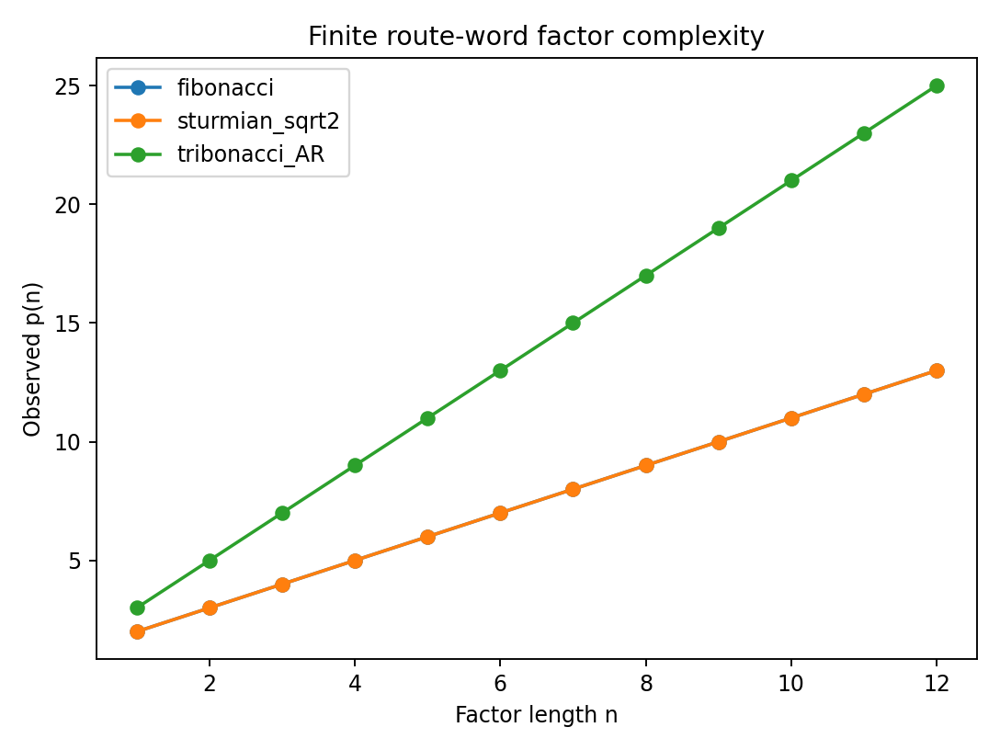
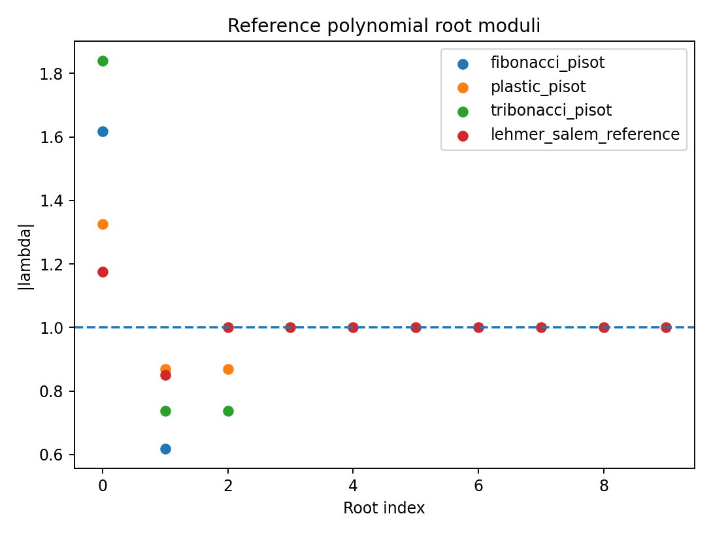

# Appendix G — AI-Readable Canonical Node Pack

Generated from current canonical node files. YAML front matter controls gate and lifecycle.

---

## SOURCE: G-701_Evaluation_Differential.md

---
node_id: "G-701"
canonical_name: "Evaluation Differential"
namespace: "NODE"
gate: "GREEN"
lifecycle: "ACTIVE"
classification: "Evaluation, Control, and Route Grammar"
claim_gate_detail: "None"
metadata_standard: "I-06"
---

# Node G-701: Evaluation Differential

Dependencies:
Upstream: A-103 Differential (canonical definition), B-206 Paired Loop (response context)
Downstream: G-702 Evaluation

Note: This node is a downstream specialization of A-103 Differential.
Scope here: difference between current state and response state within the evaluation cycle.
Does not redefine A-103. Cross-reference only.

Definition:
The Evaluation Differential measures the difference between the current state
and the response state. It is the input to Evaluation.

Delta_n = R_n - I_n

Differential measures difference. Differential does not determine action.

Mathematics:
Delta_n = R_n - I_n

If R_n = I_n: Delta_n = 0. No difference. No evaluation signal.
If R_n != I_n: Delta_n != 0. Differential exists. Evaluation proceeds.

Operational Chain:
Current State + Response State => Evaluation Differential => Evaluation

Yellow Audit:
- Whether Delta_n is scalar or vector not specified
- Whether all components of state difference are captured in a single differential unresolved
- Relationship between Delta_n and Threshold value T (B-207) not yet formalized

---

---

## SOURCE: G-702_Evaluation.md

---
node_id: "G-702"
canonical_name: "Evaluation"
namespace: "NODE"
gate: "YELLOW"
lifecycle: "ACTIVE"
classification: "Evaluation, Control, and Route Grammar"
claim_gate_detail: "None"
metadata_standard: "I-06"
---

# Node G-702: Evaluation

Dependencies:
Upstream: G-701 Evaluation Differential
Downstream: G-703 Modulation, G-704 Kabeuchi, B-207 Threshold (downstream consumer), G-708 Persistence B, G-710 Grow The Fuck Up Gate, G-711 Gate 7, G-712 Evaluation Mathematics

Definition:
Evaluation examines the differential and determines what it means.
Evaluation asks: What changed? Where? Does it matter?
Is it coherent? Is it noise? Does it require action?

Evaluation does not act. It assesses.

Root Rule: Void Evaluates.

E_n = E(Delta_n)

Mathematics (Yellow — mechanism not yet derived):
Evaluation takes Delta_n as input and produces an evaluation signal E_n.

Candidate form (not yet derived):
E_n = E(Delta_n, T_n, context)

where:
Delta_n = current differential
T_n = current threshold value
context = history, scale, mode type

Possible evaluation outcomes:
- Noise: Delta_n is below significance threshold. No action required.
- Signal: Delta_n exceeds significance threshold. Action may be required.
- Contradiction: Delta_n conflicts with expected pattern. Review required.
- Coherent: Delta_n is consistent with expected pattern. Continue.

Operational Chain:
Evaluation Differential => Evaluation => Modulation

Yellow Audit:
- Evaluation mechanism not yet derived
- What constitutes noise vs signal not formally specified
- Significance threshold for evaluation not yet defined
- Whether Evaluation is binary (act/don't act) or graded unresolved
- Relationship between E_n and Threshold Windows (B-208) not yet formalized
- Role established. Mechanism unresolved.

Future Work:
Derive evaluation mechanism from update rule parameters.
Define significance threshold in terms of gamma, beta, and lattice parameters.
Connect E_n to Threshold Windows (B-208) for scale-invariant application.

---

---

## SOURCE: G-703_Modulation.md

---
node_id: "G-703"
canonical_name: "Modulation"
namespace: "NODE"
gate: "YELLOW"
lifecycle: "ACTIVE"
classification: "Evaluation, Control, and Route Grammar"
claim_gate_detail: "None"
metadata_standard: "I-06"
---

# Node G-703: Modulation

Dependencies:
Upstream: G-702 Evaluation, B-207 Threshold State, B-216 Threshold Mathematics
Downstream: G-705 Correction, B-210 Return, B-209 Break Condition,
G-708 Persistence B, G-710 Grow The Fuck Up Gate, G-711 Gate 7,
G-713 Modulation Mathematics

## Definition

Modulation converts an evaluation signal into a bounded change of activation,
polarity, integrity support, or access state.

Root Rule: Field Modulates.

```text
M_n = M(E_n, Theta_n, Theta*_n, available_actions)
```

where

```text
Theta_n = (q_n,a_n,p_n).
```

## Action Set

- Hold: no commanded change.
- Increase: raise activation.
- Decrease: lower activation.
- Redirect: change polarity without requiring an activation increase.
- Stabilize: move the state toward a selected reference.
- Reject: close or reduce an access gate.
- Admit: open or increase an access gate.

Decrease is a normal healthy action. It includes cooling, rest, de-escalation,
resource conservation, and recovery.

## Mathematical Boundary

Modulation does not decide whether the relationship is valuable or whether a
person should obey another person. It selects a state change inside the control
space defined by B-216. Independent participants retain self-control under
G-720.

## Yellow Result

The role and controlled variables are explicit. The exact action-selection rule
is formalized in G-713.

## Yellow Audit

- Scale-specific actuation limits require calibration.
- Whether multiple actions can be applied concurrently is handled as a control
  vector in G-713 but remains an implementation choice.
- Bronze requires a reproducible simulation.

---

## SOURCE: G-704_Kabeuchi.md

---
node_id: "G-704"
canonical_name: "Kabeuchi"
namespace: "NODE"
gate: "YELLOW"
lifecycle: "ACTIVE"
classification: "Evaluation, Control, and Route Grammar"
claim_gate_detail: "None"
metadata_standard: "I-06"
---

# Node G-704: Kabeuchi

Dependencies:
Upstream: G-701 Evaluation Differential, G-702 Evaluation, G-703 Modulation
Downstream: G-705 Correction

Definition:
Kabeuchi is constructive differential review.
It is the process of receiving a differential, evaluating it, and modulating in response.
Kabeuchi does not generate the differential.
Kabeuchi receives, assesses, and acts.

Delta_n -> E(Delta_n) -> M(E(Delta_n))

Kabeuchi is not a separate agent. It is the name for the full evaluation-modulation
cycle applied constructively — with the intent to improve rather than merely respond.

The constructive intent distinguishes Kabeuchi from passive reaction:
- Passive reaction: respond to differential without evaluation
- Kabeuchi: evaluate the differential, determine its meaning, modulate deliberately

Mathematics:
Kabeuchi cycle:
1. Receive: Delta_n = R_n - I_n
2. Evaluate: E_n = E(Delta_n)
3. Modulate: M_n = M(E_n)
4. Apply: I_{n+1} = I_n + alpha * M_n

Operational Chain:
Evaluation Differential => Evaluation => Modulation => Kabeuchi => Correction

Yellow Audit:
- Inherits Yellow status from G-702 Evaluation and G-703 Modulation
- Constructive intent is defined conceptually but not yet formalized mathematically
- Distinction between Kabeuchi and passive reaction not yet formally specified

---

---

## SOURCE: G-705_Correction.md

---
node_id: "G-705"
canonical_name: "Correction"
namespace: "NODE"
gate: "YELLOW"
lifecycle: "ACTIVE"
classification: "Evaluation, Control, and Route Grammar"
claim_gate_detail: "None"
metadata_standard: "I-06"
---

# Node G-705: Correction

Dependencies:
Upstream: G-703 Modulation, G-704 Kabeuchi
Downstream: G-706 Validation, G-707 Persistence A

Definition:
Correction is the application of the modulation signal to update the current state.
It is the mechanism by which evaluation and modulation produce change.

I_{n+1} = I_n + alpha * M(E(Delta_n))

where 0 < alpha < 1 is the update gain.

Mathematics:
I_{n+1} = I_n + alpha * M_n

If M_n = 0: I_{n+1} = I_n. No correction. State unchanged.
If M_n != 0: I_{n+1} != I_n. Correction applied. State updated.

Update gain alpha controls how aggressively the correction is applied:
alpha -> 0: very slow correction. High stability. May miss fast changes.
alpha -> 1: very fast correction. Low stability. May overcorrect.

Relationship to update rule (A-109, A-111):
Correction is the deliberate application of a modulation signal.
The One-Wave update rule is the automatic field-level instantiation of the same concept.
In the update rule: beta_i(<psi_j> - psi_i) is the automatic correction term.
In G-705: alpha * M_n is the deliberate correction term.

Operational Chain:
Modulation => Correction => Updated State => Validation

Yellow Audit:
- alpha not yet specified
- Whether alpha is fixed or adaptive unresolved
- Whether overcorrection (alpha too large) produces instability not yet analyzed
- Inherits Yellow status from G-702 and G-703

---

---

## SOURCE: G-706_Validation.md

---
node_id: "G-706"
canonical_name: "Validation"
namespace: "NODE"
gate: "GREEN"
lifecycle: "ACTIVE"
classification: "Evaluation, Control, and Route Grammar"
claim_gate_detail: "None"
metadata_standard: "I-06"
---

# Node G-706: Validation

Dependencies:
Upstream: G-705 Correction, G-701 Evaluation Differential
Downstream: G-707 Persistence A, G-708 Persistence B, G-709 Regulated-Response Balance, G-711 Gate 7, I_{n+1} (updated state)

Definition:
Validation is confirmation through successful participation in a cycle.
A state is validated when it produces a non-zero feedback signal through interaction.
Validation is not absolute proof. It is confirmation through participation.

Validation = confirmation through successful participation in a cycle

Mathematics:
State => Interaction => Feedback => Validation

Let F_n be the feedback signal from the interaction.

If F_n = 0: V_n = 0. No feedback. No validation.
If F_n != 0: V_n = V(F_n). Feedback exists. Validation occurs.

F_n != 0 => V_n

Operational Chain:
Correction => Interaction => Feedback => Validation => Updated State

Yellow Audit:
- What constitutes sufficient feedback for validation not yet specified
- Whether validation is binary or graded unresolved
- Relationship between V_n and Threshold Windows (B-208) not yet formalized

---

---

## SOURCE: G-707_Persistence_A.md

---
node_id: "G-707"
canonical_name: "Persistence A"
namespace: "NODE"
gate: "GREEN"
lifecycle: "ACTIVE"
classification: "Evaluation, Control, and Route Grammar"
claim_gate_detail: "None"
metadata_standard: "I-06"
---

# Node G-707: Persistence A

Dependencies:
Upstream: G-705 Correction, G-706 Validation
Downstream: G-708 Persistence B, G-709 Regulated-Response Balance

Definition:
Persistence A is mathematical convergence of the correction cycle.
If successive corrections produce diminishing changes, the state is converging.

lim_{n->infinity} |I_{n+1} - I_n| -> 0

Mathematics:
|I_{n+1} - I_n| = |alpha * M_n|

Convergence requires: |alpha * M_n| -> 0 as n -> infinity.

This holds when M_n -> 0, meaning the modulation signal diminishes over time.
Which means the evaluation differential Delta_n -> 0.
Which means R_n -> I_n: the response matches the current state.

Convergence chain:
R_n -> I_n => Delta_n -> 0 => E_n -> 0 => M_n -> 0 => |I_{n+1} - I_n| -> 0

lim_{n->infinity} |I_{n+1} - I_n| -> 0

This is purely mathematical. It does not by itself prove successful balance.
That interpretation belongs to G-708 Persistence B.

Operational Chain:
Validation => Convergence Check => Persistence A

Yellow Audit:
- Convergence rate not specified
- Whether convergence is monotonic or oscillatory not specified
- Whether convergence implies stability in the sense of E-505 not yet established

---

---

## SOURCE: G-708_Persistence_B.md

---
node_id: "G-708"
canonical_name: "Persistence B"
namespace: "NODE"
gate: "YELLOW"
lifecycle: "ACTIVE"
classification: "Evaluation, Control, and Route Grammar"
claim_gate_detail: "None"
metadata_standard: "I-06"
---

# Node G-708: Persistence B

Dependencies:
Upstream: G-707 Persistence A, G-702 Evaluation, G-703 Modulation
Downstream: G-709 Regulated-Response Balance

Definition:
Persistence B is the interpretation that mathematical convergence (G-707)
indicates successful balance.

Convergence alone does not prove balance.
Convergence could indicate:
- Successful balance (desired outcome)
- Stagnation (state is stuck, not balanced)
- False equilibrium (local minimum, not global)

Persistence B claims that convergence plus valid evaluation and modulation
indicates successful balance.

lim_{n->infinity} |I_{n+1} - I_n| -> 0 => successful balance

Mathematics:
Requires all three:
1. Convergence: lim |I_{n+1} - I_n| -> 0  (G-707)
2. Valid evaluation: E_n correctly identifies signal vs noise  (G-702)
3. Valid modulation: M_n correctly selects action  (G-703)

If all three hold: Persistence B => successful balance.
If evaluation or modulation is invalid: convergence may be spurious.

Operational Chain:
Persistence A + Valid Evaluation + Valid Modulation => Persistence B => Balance

Yellow Audit:
- Depends on Yellow status of G-702 and G-703
- Distinction between successful balance and stagnation not yet formalized
- Whether local vs global balance is detectable from the cycle alone unresolved

---

---

## SOURCE: G-709_Balance.md

---
node_id: "G-709"
canonical_name: "Regulated-Response Balance"
namespace: "NODE"
gate: "GREEN"
lifecycle: "ACTIVE"
classification: "Evaluation, Control, and Route Grammar"
claim_gate_detail: "Definition is GREEN; promotion to YELLOW depends on upstream audit completion"
metadata_standard: "I-06"
---

# Node G-709: Regulated-Response Balance

## Name Disambiguation

G-709 **Regulated-Response Balance** is a feedback-scaled response rule. It is distinct from B-201 **Equilibrium Balance**, which measures scalar equilibrium/imbalance. The two nodes share a historical word but not a mechanism. **Do not merge them.**

Dependencies:
Upstream: G-708 Persistence B, G-706 Validation
Downstream: G-710 Grow The Fuck Up Gate, Books

Definition:
Balance is regulated response under feedback.
A balanced state does not eliminate response — it scales response proportionally.
The response is neither absent nor excessive.

Balance = Regulated Response Under Feedback

Mathematics:
Q_n = k_n * F_n,   0 <= k_n <= k_max

where:
Q_n = response at step n
F_n = feedback signal at step n
k_n = regulation coefficient at step n
k_max = maximum regulation coefficient

If k_n = 0: no response. Stagnation.
If k_n = k_max: maximum regulated response.
If k_n > k_max: unregulated. Response exceeds balance.

Balanced response: Q_n = k_n * F_n with 0 < k_n <= k_max

Operational Chain:
Feedback => Regulated Response => Balance

Gate note:
This node is GREEN at the definition level. Promotion to YELLOW remains blocked until the relevant G-702 and G-703 audits are complete.

Yellow Audit:
- k_n and k_max not yet derived from lattice parameters
- Whether k_n is fixed or adaptive unresolved
- Relationship between k_n and update gain alpha (G-705) not yet formalized

---

---

## SOURCE: G-710_Grow_The_Fuck_Up_Gate.md

---
node_id: "G-710"
canonical_name: "Grow The Fuck Up Gate"
namespace: "NODE"
gate: "GREEN"
lifecycle: "ACTIVE"
classification: "Evaluation, Control, and Route Grammar"
claim_gate_detail: "Definition is GREEN; promotion to YELLOW depends on upstream audit completion"
metadata_standard: "I-06"
---

# Node G-710: Grow The Fuck Up Gate

Dependencies:
Upstream: G-709 Regulated-Response Balance, G-702 Evaluation, G-703 Modulation
Downstream: G-711 Gate 7, Books, G-718 Connection Gates (regulated-response parallel), G-719 Neural System Functional Analogy Map (Six Mind grounding), G-720 No Control But Self-Control (R_a/R_c grounding)

Definition:
The Grow The Fuck Up Gate is the transition from unregulated reaction to regulated response.
It is the boundary between a system that reacts and a system that responds.

Reaction: F_n -> Q_n >> F_n  (response wildly exceeds feedback)
Balance:  F_n -> Q_n = k_n * F_n  (response is proportional to feedback)

The gate is passed when the system consistently produces regulated responses
rather than unregulated reactions.

Mathematics:
Unregulated reaction:
Q_n = g * F_n,   g >> k_max

Regulated response:
Q_n = k_n * F_n,   0 < k_n <= k_max

Gate condition:
g -> k_n  (gain drops from unregulated to regulated)

Full cycle through the gate:
Reaction -> Evaluation -> Modulation -> Validation -> Balance

Operational Chain:
Unregulated Reaction => Evaluation => Modulation => Validation => Regulated Response => Balance

Gate note:
This node is GREEN at the definition level. Promotion to YELLOW remains blocked until the relevant G-702 and G-703 audits are complete.

Yellow Audit:
- Whether the gate is crossed gradually or suddenly unresolved
- Whether every system can pass this gate or only some unresolved
- Relationship between the gate and Threshold Windows (B-208) not yet formalized

---

---

## SOURCE: G-711_Gate_7.md

---
node_id: "G-711"
canonical_name: "Gate 7"
namespace: "NODE"
gate: "GREEN"
lifecycle: "ACTIVE"
classification: "Evaluation, Control, and Route Grammar"
claim_gate_detail: "None"
metadata_standard: "I-06"
---

# Node G-711: Gate 7

Dependencies:
Upstream: G-706 Validation, G-702 Evaluation, G-703 Modulation
Downstream: Repository-wide — Gate 7 is the review gate for the entire framework. Also feeds G-716 One-Wave Conversion Grammar and G-719 Neural System Functional Analogy Map (shape-level parallel only).

Definition:
Gate 7 is the review gate.
Gates 1-6 build state. Gate 7 reviews state.

Gate 7 does not build. It reviews.
Gate 7 asks: Is what was built internally consistent?
Does it survive interaction? Does it validate?

Evaluate + Modulate + Validate

Root Split:
Void -> Evaluate
Field -> Modulate

Validation emerges from successful interaction between the two.

Gates 1-6 Build -> Gate 7 Reviews

Mathematics:
Gate 7 applies the full evaluation cycle to the repository itself:

Delta_repo = current_state - expected_state
E_repo = E(Delta_repo)
M_repo = M(E_repo)
V_repo = V(M_repo)

If V_repo != 0: the repository survives Gate 7 review.
If V_repo = 0: the repository requires correction.

Gate 7 is not a one-time event.
It is applied recursively as the repository grows.

Operational Chain:
Gates 1-6 (Build) => Gate 7 (Review) => Validated Repository State

Yellow Audit:
- Formal specification of what constitutes repository validation not yet derived
- Whether Gate 7 can be automated or requires human review unresolved

---

---

## SOURCE: G-712_Evaluation_Mathematics.md

---
node_id: "G-712"
canonical_name: "Evaluation Mathematics"
namespace: "NODE"
gate: "YELLOW"
lifecycle: "ACTIVE"
classification: "Resolution / Formalization Node"
claim_gate_detail: "None"
metadata_standard: "I-06"
---

# Node G-712: Evaluation Mathematics

Reason:
Definition complete.
Candidate signal form established (E_n = E(Delta_n, T_n, context)).
Significance threshold, signal classification, and context-integration
mechanism remain open.

EXTRACTED CANDIDATE (this turn, from ONEWAVE_BRAIN_raw_material_
UNVALIDATED.md — checked, reframed, stripped of unverified framing):
that file proposed a "Coherence Ratio Threshold," E_pattern/E_noise > 1,
used to decide whether a detected signal is significant enough to act
on. The original framing ("Dream Generation Test," "Higher Mind")
is NOT adopted — those terms have no upstream definition and aren't
used here. The underlying mathematical form is real and directly fills
this node's own flagged gap:

Significance threshold candidate: E_n is significant iff
E_pattern(Delta_n) / E_noise(Delta_n) > 1
where E_pattern is the structured/repeatable component of the
evaluation signal and E_noise is its unstructured/random component.
This is a standard signal-detection form (signal-to-noise thresholding),
not a One-Wave-specific invention — its value here is filling this
node's real, previously-open gap with a concrete, checkable candidate
rather than leaving "significance threshold" unspecified.

Dependencies:
Upstream: G-702 Evaluation
Downstream: G-713 Modulation Mathematics, B-216 Threshold Mathematics, G-716 One-Wave Conversion Grammar

Definition:
Evaluation Mathematics is the formal mathematical framework governing how
E(Delta_n) produces a quantified evaluation signal.
The role of Evaluation is established (G-702) but its mechanism is not yet derived.

Mathematics (partial):
E_n = E(Delta_n, T_n, context)

Required components (not yet derived):
1. Significance threshold: below what Delta_n value is the signal noise?
2. Signal classification: how is the differential categorized?
3. Urgency weighting: how does T_n affect the evaluation?
4. Context integration: how does history influence current evaluation?

Candidate form (not yet derived):
E_n = sigma(w_1 * Delta_n + w_2 * T_n + w_3 * history_n)

where:
sigma = evaluation activation function
w_1, w_2, w_3 = weighting coefficients

Operational Chain:
Evaluation Differential => Evaluation Mathematics => Evaluation Signal

Yellow Audit:
- Significance threshold not yet defined
- Signal classification scheme not established
- Urgency weighting function not derived
- Context integration mechanism not derived
- Candidate form is speculative — not operational

Future Work:
Derive significance threshold from lattice parameters gamma and beta.
Connect evaluation signal to Threshold Windows (B-208).
Test candidate form against known paired-loop dynamics.

---

---

## SOURCE: G-713_Modulation_Mathematics.md

---
node_id: "G-713"
canonical_name: "Modulation Mathematics"
namespace: "NODE"
gate: "YELLOW"
lifecycle: "ACTIVE"
classification: "Resolution / Formalization Node"
claim_gate_detail: "None"
metadata_standard: "I-06"
---

# Node G-713: Modulation Mathematics

Dependencies:
Upstream: G-703 Modulation, G-712 Evaluation Mathematics,
B-216 Threshold Mathematics
Downstream: G-714 Decision Mathematics, G-716 One-Wave Conversion Grammar

## State and Candidate Controls

Let

```text
Theta_n = [q_n,a_n,p_n]^T
```

and let each available action `r` provide a bounded candidate command

```text
u^(r) = [u_q^(r),u_a^(r),u_p^(r)]^T.
```

Example action templates:

```text
Hold:      [0, 0, 0]
Increase:  [0, +delta_a, 0]
Decrease:  [0, -delta_a, 0]
Redirect:  [0, 0, -k_p(p_n-p*_n)]
Stabilize: -K(Theta_n-Theta*_n)
Reject:    [-delta_q, 0, 0] with gate closure metadata
Admit:     [+delta_q, 0, 0] with gate opening metadata
```

`Reject` and `Admit` must still obey G-720: they modify one's own access and
participation, not another independent system's internal state.

## Predicted Next State

For action `r`:

```text
Theta_hat^(r) = Pi_Omega(Theta_n + B u^(r)).
```

## Cost Function

Choose the action minimizing

```text
J(r) =
  (Theta_hat^(r)-Theta*_n)^T W (Theta_hat^(r)-Theta*_n)
  + rho ||u^(r)||^2
  + lambda_D D(Theta_hat^(r))
  + lambda_S S(r).
```

where:

- `W` weights integrity, activation, and polarity errors,
- `rho` penalizes unnecessary control effort,
- `D` penalizes danger states,
- `S` penalizes actions that violate scale-specific safety or access constraints.

A candidate danger penalty is

```text
D(Theta) = [a-a_danger]_+^2 + [q_break-q]_+^2.
```

The selected action is

```text
r_n = argmin_r J(r).
```

This replaces the earlier undefined `argmax utility` placeholder with an
explicit bounded optimization rule.

## Continuous Control Form

When actions are allowed to blend rather than remain discrete, use

```text
u_n = argmin_u
      (Theta_n + Bu - Theta*)^T W (Theta_n + Bu - Theta*)
      + rho u^T u
```

subject to

```text
u_min <= u <= u_max.
```

Without active bounds and with `B=I`, the minimizer is

```text
u_n = -(W + rho I)^(-1) W (Theta_n-Theta*).
```

Every eigenvalue of `(W + rho I)^(-1)W` lies in `[0,1)`, so the command moves
toward the reference without an unbounded one-step overshoot in the ideal
noise-free case.

## Down-Modulation Result

If activation exceeds its reference, `a_n > a*_n`, the continuous solution has

```text
u_a < 0.
```

Therefore Decrease is selected mathematically when it lowers state error and
danger cost more than its control effort. Lowering energy is not a special
failure path; it follows from the same optimization rule as increasing it.

## Internal Tests Completed

1. The action set spans hold, amplitude change, polarity change, access change,
   and restoration.
2. The cost function penalizes overload and broken integrity separately.
3. The continuous minimizer is finite for `rho > 0`.
4. Independent axis weights allow activation and polarity to be controlled
   separately.
5. A bounded command set prevents the optimizer from demanding impossible
   movement.

## Yellow Audit

- `W`, `rho`, `lambda_D`, and `lambda_S` require scale-specific calibration.
- The access-safety penalty must be instantiated for hardware, individuals, and
  groups separately under I-04.
- Bronze requires executing this selection rule across representative
  trajectories and recording successes and failures.

---

## SOURCE: G-714_Decision_Mathematics.md

---
node_id: "G-714"
canonical_name: "Decision Mathematics"
namespace: "NODE"
gate: "YELLOW"
lifecycle: "ACTIVE"
classification: "Resolution / Formalization Node"
claim_gate_detail: "None"
metadata_standard: "I-06"
---

# Node G-714: Decision Mathematics

Reason:
Definition complete.
Candidate decision form established (Return/Break threshold comparison).
Decision criterion, threshold values, and determinism vs. probabilism remain open.

Dependencies:
Upstream: G-713 Modulation Mathematics, B-208 Threshold Windows, B-209 Break Condition, B-210 Return
Downstream: B-209 Break Condition (outcome), B-210 Return (outcome), G-716 One-Wave Conversion Grammar

Definition:
Decision Mathematics is the formal mathematical framework governing the
selection of Return vs Break in the Threshold system.
This is the mathematical instantiation of CCD-04 at the evaluation level.

Decision Mathematics = formal framework for Return vs Break selection

Mathematics (partial):
At the Break Risk / Decision Point (B-208, 45-30 band):

Decision: Return or Break?

Required components (not yet derived):
1. Decision criterion: what condition triggers Return vs Break?
2. Decision threshold: at what T value does the decision change?
3. Decision inputs: which signals inform the decision?
4. Decision reversibility: can a Break decision be reversed?

Candidate form (not yet derived):
Decision = f(T_n, E_n, M_n, history_n)

If f > threshold_return: Return
If f < threshold_break: Break
If threshold_break <= f <= threshold_return: ambiguous — additional evaluation required

Operational Chain:
Threshold (B-207) + Evaluation + Modulation => Decision Mathematics => Return or Break

Yellow Audit:
- Decision criterion not derived
- Decision threshold not specified
- Whether decision is deterministic or probabilistic unresolved
- Relationship between Decision Mathematics and CCD-04 (selection mechanism) not yet formalized
- This node is the Appendix G instantiation of CCD-04

Future Work:
Derive decision criterion from threshold dynamics.
Connect to Threshold Mathematics (B-216).
Test against known paired-loop break and return events.

---

---

## SOURCE: G-715_Stellar_Boundary_Reversal.md

---
node_id: "G-715"
canonical_name: "Stellar Boundary Reversal"
namespace: "NODE"
gate: "YELLOW"
lifecycle: "ACTIVE"
classification: "Evaluation, Control, and Route Grammar"
claim_gate_detail: "None"
metadata_standard: "I-06"
---

# Node G-715: Stellar Boundary Reversal

# G-715: STELLAR BOUNDARY REVERSAL

Node ID: G-715 (alternate/internal reference: FUNC-SBR-001)


Class: FUNCTION

Function Type:
Boundary reversal / pressure-wave conversion / stellar atmosphere transition

Placement Target:
GreatLibrary/Repository/Functions/Stellar_Boundary_Reversal/

Not a book chapter.
Not a book node.
This is a reusable function node that can later be referenced by stellar chapters, solar-system chapters, plasma nodes, boundary nodes, and conversion grammar nodes.

---

## 1. Core Claim

Stellar Boundary Reversal is the function where a star's visible surface acts as a boundary gate rather than the final heat layer.

The function describes how stored pressure, magnetic tension, and wave motion can pass through or around a visible boundary and appear as outer plasma heating above that boundary.

In standard solar physics, this is connected to the coronal heating problem:

the visible solar surface is much cooler than the outer corona.

In One-Wave language:

the surface is not the end of heat expression.

the surface is the hold boundary.

the corona is the release field.

---

## 2. Standard Physics Anchor

The Sun's photosphere is the visible surface layer. It is far cooler than the corona, the outer solar atmosphere, which can reach temperatures of millions of kelvin.

This is the coronal heating problem.

Simple expectation:

```text
core hot -> surface cooler -> outer atmosphere cooler
```

Observed solar structure:

```text
core hot -> photosphere cooler -> corona much hotter
```

The problem is not that the corona is hotter than the stellar core.

The problem is that the corona is far hotter than the visible surface beneath it.

Mainstream mechanism families include:

```text
magnetic reconnection
Alfven / MHD wave transport
wave dissipation
turbulence
magnetic switchbacks or field reversals in the solar wind
```

Standard science has not reduced the entire problem to one settled mechanism. Current models treat reconnection, MHD waves, Alfven waves, and turbulent magnetic-field behavior as major candidates or contributors.

---

## 3. One-Wave Function Definition

Stellar Boundary Reversal is the conversion of held stellar boundary tension into released outer plasma motion.

Function definition:

```text
interior compression
-> visible surface hold
-> magnetic / wave tension
-> boundary reversal or release
-> outer plasma energizing
-> coronal heating
```

Short form:

```text
Hold -> Fold -> Release -> Heat -> Flow
```

The visible surface is the gate.

The corona is the release zone.

The reversal is the appearance of stronger heat expression after the boundary instead of only before it.

---

## 4. Boundary Reversal Rule

Rule:

```text
When a stellar surface acts as a boundary gate, energy may appear beyond the boundary as wave release rather than remain expressed as local surface heat.
```

Simpler:

```text
The star does not only heat outward.
It stores, folds, and releases through its boundary.
```

One-Wave statement:

```text
The corona is hotter than the visible surface because the surface is a compression boundary, and the corona is where boundary tension converts into released wave energy.
```

---

## 5. Two-Reference Structure

This function uses two references:

```text
Reference A: Photosphere / visible surface / boundary hold
Reference B: Corona / outer atmosphere / release field
```

Shared middle:

```text
Transition region / magnetic boundary / wavegate
```

Base form:

```text
A(0)B
B(0)A
```

Stellar form:

```text
surface hold (0) coronal release
coronal feedback (0) surface modulation
```

Mirror form:

```text
1(0)-1
-1(0)1
```

Function meaning:

```text
The surface holds.
The corona releases.
The release can fold back through magnetic switchback structures.
The fold can re-enter the boundary system as modulation.
```

---

## 6. 2D One-Wave Model

Flat model:

```text
[Interior Pressure] -> [Surface Boundary] -> [Corona Release]

Compression side       Gate              Release side
Stored energy          0-point           Released wave energy
```

Expected thermal fade:

```text
hot -> warm -> cold
```

Observed reversal:

```text
hot -> warm -> hotter
```

One-Wave read:

```text
hot compression
-> boundary hold
-> delayed release layer
```

Energy mode change:

```text
thermal surface expression
-> magnetic / wave transport
-> plasma heating expression
```

---

## 7. 3D One-Wave Model

In 3D, the corona is not a smooth shell.

It is a live release volume made of loops, open lines, arcs, folds, turbulent paths, and escaping plasma.

3D structure:

```text
stellar body = pressure knot
photosphere = active boundary shell
magnetic loops = tension pathways
corona = release volume
solar wind = open outflow
switchbacks = folded reversal structures inside outflow
```

3D operation:

```text
1. Interior pressure pushes outward.
2. Surface boundary resists and holds structure.
3. Magnetic paths store twist and tension.
4. Boundary motion shakes those paths.
5. Reconnection or wave dissipation releases stored tension.
6. Corona receives energy after the visible surface.
7. Open field regions carry release outward as solar wind.
8. Switchbacks appear as temporary reverse folds in outward flow.
```

One-Wave summary:

```text
A star is a pressure knot with a live boundary.
The corona is not merely atmosphere.
The corona is the release zone of the boundary.
```

---

## 8. Switchback Subfunction

Subfunction:
Magnetic Switchback as Stellar Boundary Fold

Status:
YELLOW

Definition:
A switchback is a temporary reversal, fold, or kink in the outward magnetic reference of the solar wind.

Standard view:
Parker Solar Probe has observed sudden magnetic-field reversals or deflections in the near-Sun solar wind. These are often called switchbacks. They are studied as Alfvenic structures, field-line folds, wave effects, or possible signatures of reconnection and solar-wind expansion behavior.

One-Wave view:

```text
outward release
-> fold into reverse reference
-> return to outward release
```

Base grammar:

```text
1(0)-1
-1(0)1
```

Switchback form:

```text
out(0)back
back(0)out
```

Operational meaning:

```text
The outward field briefly carries its opposite direction inside itself.
```

This makes the switchback a mirror event, not a separate object.

---

## 9. Mathematical Skeleton

Let:

```text
E_c = energy stored in compressed stellar interior / boundary system
E_s = energy held at the surface boundary
E_m = magnetic / tension energy
E_w = wave-carried energy
E_cor = coronal plasma energy
T_s = surface / photosphere temperature
T_cor = corona temperature
```

Observed coronal reversal condition:

```text
T_cor > T_s
```

Naive gradient expectation:

```text
T_core > T_s > T_cor
```

Observed stellar boundary reversal:

```text
T_core > T_cor > T_s
```

This is only paradoxical if energy is assumed to move as direct thermal conduction only.

One-Wave energy chain:

```text
E_c -> E_s -> E_m / E_w -> E_cor
```

Coronal heating condition:

```text
dE_cor/dt = P_release - P_loss
```

For heating:

```text
P_release > P_loss
```

Where:

```text
P_release = P_wave + P_reconnection + P_turbulence
```

Stable hot corona condition:

```text
P_release ~= P_loss
```

Boundary release function:

```text
P_boundary_release = f(E_s, E_m, E_w, Delta B, Delta P, Delta rho)
```

Where:

```text
Delta B = magnetic-field change
Delta P = pressure-gradient change
Delta rho = density-gradient change
```

The corona becomes hot when boundary release is deposited above the surface:

```text
E_s + E_m -> E_w -> E_cor
```

instead of remaining only as:

```text
E_s -> surface heat
```

---

## 10. Pressure / Density Note

The corona is extremely hot but very thin.

High temperature does not mean the corona contains more total heat energy than the dense stellar interior or visible surface.

Temperature measures average particle energy.

Total heat content also depends on how much matter is present.

One-Wave translation:

```text
Thin release field = fewer carriers, higher motion per carrier.
Dense boundary shell = more carriers, stronger hold, lower expressed temperature.
```

So:

```text
low density + strong energy injection = high temperature expression
```

This supports the boundary-release interpretation.

---

## 11. Functional Chain

Full function:

```text
stellar compression
-> boundary hold
-> magnetic tension
-> oscillation / shear / twist
-> mirror fold or reconnection
-> release into thin plasma
-> coronal overheating
-> solar wind continuation
```

Compressed function:

```text
Hold -> Fold -> Release -> Heat -> Flow
```

Mirror-gate function:

```text
surface(0)corona
corona(0)surface
```

Switchback function:

```text
out(0)back
back(0)out
```

Solar-wind function:

```text
release -> escape -> expansion flow
```

---

## 12. Relation to Bronze One-Wave Conversion Grammar

This function may reference the Bronze grammar:

```text
24 -> 12 -> 6 -> 3 -> 1 -> 24
```

But this function is not automatically Bronze.

The Bronze grammar is the stable conversion form.

Stellar Boundary Reversal is an applied function that may use that grammar to model stellar boundary behavior.

Current status remains:

```text
YELLOW
```

Reason:
The function is structurally clear and aligned with known coronal heating questions, but it still requires simulation and data comparison before Bronze.

---

## 13. Test / Simulation Direction

Simulation target:

Build a two-layer boundary model:

```text
Layer A = dense surface hold
Layer B = thin outer plasma release
```

Variables:

```text
rho_s = surface density
rho_cor = coronal density
P_s = boundary pressure
B = magnetic-field strength / tension term
F_w = wave flux
P_release = release power
P_loss = radiative + conductive + expansion loss
```

Test condition:

```text
Can a dense boundary layer remain cooler while a thin outer layer becomes hotter when wave / magnetic release is deposited above the boundary?
```

Expected One-Wave condition:

```text
If P_release into the outer layer exceeds local losses,
then T_cor > T_s can appear without requiring direct heat flow from cooler surface to hotter corona.
```

Validation target:

```text
Boundary hold must convert stored tension into release energy above the surface.
```

---

## 14. Yellow Audit

Unresolved:

```text
1. Exact conversion rule from surface boundary hold to coronal release is not yet derived.
2. Need to separate wave heating, reconnection heating, turbulence, and pressure-release terms.
3. Need to determine whether switchbacks are a cause of heating, a result of heating, or a transport signature.
4. Need mathematical connection between Mirror Gate reversal and observed magnetic-field switchbacks.
5. Need simulation showing stable condition where T_cor > T_s from boundary energy deposition.
6. Need density correction so temperature is not confused with total heat content.
7. Need connection to Bronze One-Wave Conversion Grammar without falsely promoting this function to Bronze.
```

Science alignment:

```text
Aligned with standard observation:
The corona can be much hotter than the photosphere.

Aligned with standard mechanism families:
Magnetic reconnection and MHD / Alfven wave transport are major candidate mechanisms.

One-Wave extension:
Treats the photosphere-corona transition as a boundary gate where stored pressure / magnetic tension changes mode.
```

---

## 15. Standard Science References

Reference anchors for later audit:

```text
- Solar coronal heating problem
- Magnetic reconnection
- MHD / Alfven wave heating
- Parker Solar Probe switchbacks
- Solar wind magnetic-field reversals
```

Suggested source trail:

```text
NASA / Parker Solar Probe mission materials
NASA heliophysics materials on coronal heating
Reviews on MHD wave coronal heating
Research on magnetic switchbacks observed by Parker Solar Probe
Research on reconnection at switchback boundaries
```

---

## 16. Final Function Sentence

Stellar Boundary Reversal is the function where a star's visible surface acts as a pressure and magnetic boundary gate, allowing stored boundary tension to convert into outer wave-plasma release so the corona can become hotter than the visible surface without requiring simple direct heat leakage from the surface.

---

## 17. Short Pass-Forward Version

```text
NODE: STELLAR BOUNDARY REVERSAL

Status: YELLOW
Class: FUNCTION

The solar corona is much hotter than the visible surface, creating the coronal heating problem. Standard physics explains this through magnetic reconnection, Alfven / MHD wave heating, turbulence, and magnetic switchbacks, but the full mechanism remains unresolved.

One-Wave interpretation:
The photosphere is a compression boundary, not the final heat layer. Above it, stored magnetic / pressure tension converts into outward wave release. The corona is hotter because energy is deposited after the boundary transition.

Core chain:
interior compression
-> surface boundary hold
-> magnetic / wave tension
-> boundary fold or reconnection
-> outer plasma release
-> coronal heating
-> solar wind

Mirror form:
surface(0)corona
corona(0)surface

Switchback form:
out(0)back
back(0)out

Status remains YELLOW until simulation proves that boundary release can maintain T_cor > T_surface under realistic loss conditions.
```

---

## SOURCE: G-716_One_Wave_Conversion_Grammar.md

---
node_id: "G-716"
canonical_name: "One-Wave Conversion Grammar"
namespace: "NODE"
gate: "BRONZE"
lifecycle: "ACTIVE"
classification: "Evaluation, Control, and Route Grammar"
claim_gate_detail: "None"
metadata_standard: "I-06"
---

# Node G-716: One-Wave Conversion Grammar

Class:
Core grammar / conversion function / reusable gate pattern

Placement:
Appendix G — Evaluation, Modulation, Validation, and Balance

Dependencies:
Upstream: A-117 Dimensional Integrity, G-711 Gate 7, G-712 Evaluation Mathematics, G-713 Modulation Mathematics, G-714 Decision Mathematics
Bidirectional/Lateral: D-410 Twenty-Fourfold 4D Recurrence Shell
Lateral: Mirror Gate, Paired Exchange, State Changer
Downstream: G-716a One-Wave Conversion Simulation Rule, applied boundary-reversal nodes, biological crossing nodes, stellar boundary nodes, consciousness-state conversion nodes

Definition:
One-Wave Conversion Grammar is the reusable state-change pattern by which a complex field-state compresses through ordered layers, passes through repeated zero-point gates, reaches single-crossing identity, and returns to full-field expression as a changed state.

This node defines the grammar only.
It does not claim full biological, stellar, consciousness, or external physical proof by itself.

Bronze applies to the structural conversion grammar.

---

## Core Pattern

Full expression:

```text
24 > 1(0)1 < 12 > 1(0)1 < 6 > 1(0)1 < 3 > 1(0)1 < 1 > 1(0)1 < 24
```

Compressed expression:

```text
24 -> 12 -> 6 -> 3 -> 1 -> 24
```

Ratio expression:

```text
12:1 -> 6:1 -> 3:1 -> 1:1 -> 1:24
```

Gate form:

```text
1(0)1
```

The repeated gate form represents the zero-point crossing between each conversion layer.

---

## Bronze Scope

Bronzed:

```text
24 -> 12 -> 6 -> 3 -> 1 -> 24
```

Bronzed:

```text
1(0)1
```

Bronzed:

```text
one entity
one gate sequence
one active crossing
one logged state change
```

Bronzed state path:

```text
seeded
-> compressed
-> paired
-> triadic
-> singular
-> converted
```

Not yet Gold:

```text
eel migration proof
frog/fish crossing proof
Sargasso Sea physical gate proof
stellar coronal proof
consciousness-state proof
field-measurement proof
```

Those remain downstream applications or simulation targets.

---

## Core Rule

Only one entity may occupy the active conversion crossing at a time.

```text
one crossing
one active identity
one gate sequence
one emergence log
```

This is the single-entity crossing rule.

It prevents mixed-state drift during conversion.

---

## Layer Definitions

```text
24 = full Field/Void recurrence shell / ultimate complexity / full environment
12 = high-order compression
6  = paired structural compression
3  = triadic decision / reduction layer
1  = singular crossing identity
24 = returned full field after conversion
```

The return to 24 does not mean nothing changed.

It means the entity returns to full-field expression after passing through a singular conversion point.

---

## State Path

```text
seeded
-> compressed
-> paired
-> triadic
-> singular
-> converted
```

Operational meaning:

```text
seeded      = entity enters the conversion field
compressed  = entity begins reduction from full complexity
paired      = entity resolves into paired structure
triadic     = entity reaches decision / selection layer
singular    = entity becomes one active crossing identity
converted   = entity returns to full-field expression changed
```

---

## Operational Chain

```text
full field
-> compression
-> paired reduction
-> triadic decision
-> singular crossing
-> return expansion
-> converted state
```

Short form:

```text
Field -> Compress -> Pair -> Decide -> Cross -> Return -> Convert
```

---

## Mirror / Gate Form

Base gate:

```text
1(0)1
```

Conversion sequence:

```text
24(1(0)1)12
12(1(0)1)6
6(1(0)1)3
3(1(0)1)1
1(1(0)1)24
```

Interpretation:

```text
Each layer transition must pass through a zero-point gate.
Each gate preserves continuity while allowing state change.
```

---

## State Changer Interpretation

The State Changer reads the conversion as a committed transition:

```text
old state
-> gate evaluation
-> modulation
-> validation
-> new state
```

Appendix G cycle form:

```text
I_n -> R_n -> Delta_n -> E(Delta_n) -> M(E(Delta_n)) -> V_n -> I_{n+1}
```

For this node:

```text
I_n       = current layer/state
R_n       = proposed next layer/state
Delta_n   = difference between current and proposed state
E(Delta_n) = evaluation of whether the transition is coherent
M(E)      = modulation of the crossing action
V_n       = validation that the transition completed
I_{n+1}   = next layer/state
```

---

## Success Condition

A conversion succeeds if:

```text
1. The entity enters at 24.
2. The entity moves through 12, 6, 3, and 1 in order.
3. Every transition passes through 1(0)1.
4. No second entity occupies the crossing.
5. The entity returns to 24.
6. The final state is converted.
7. The emergence log records every transition.
```

If all conditions hold:

```text
status = crossed_changed
```

---

## Failure Conditions

A conversion fails if:

```text
- the gate is already occupied
- an entity skips a layer
- an entity repeats a layer incorrectly
- the path does not reach 1
- the path does not return to 24
- the state does not change
- a transition is not logged
- multiple entities enter the same active crossing
```

Failure does not destroy the grammar.

It marks a failed crossing event.

---

## Mathematics Skeleton

Let:

```text
L = ordered layer path
L = [24, 12, 6, 3, 1, 24]
```

Let:

```text
G = gate operator
G = 1(0)1
```

Let:

```text
S_n = state at layer n
T_n = transition from S_n to S_{n+1}
```

Then:

```text
T_n = G(S_n -> S_{n+1})
```

Full path:

```text
S_24 ->G S_12 ->G S_6 ->G S_3 ->G S_1 ->G S_24'
```

Where:

```text
S_24' != S_24
```

because the returned full-field state has changed.

Conversion condition:

```text
S_final = converted(S_initial)
```

Single-crossing condition:

```text
N_active_gate_entities <= 1
```

Valid conversion requires:

```text
N_active_gate_entities = 1
```

during active crossing.

---

## Bronze Validation

This node is Bronze because:

```text
1. The conversion sequence is defined.
2. The gate form is defined.
3. The state path is defined.
4. The single-crossing rule is defined.
5. The success and failure conditions are defined.
6. The grammar can be executed as a simulation rule.
7. The node can serve as a stable reference pattern for downstream functions.
```

Bronze does not mean externally proven.

Bronze means structurally stable and executable as a rule.

---

## Downstream Addendum

The simulation rule should be attached as:

```text
G-716a: One-Wave Conversion Simulation Rule
```

G-716a remains YELLOW until a first successful validation with reproducible emergence logs supports BRONZE. SILVER requires a second independent application under I-02.

---

## Dimensional Boundary

The labels 24, 12, 6, 3, and 1 are recursive conversion layers in this grammar. They are not automatically spatial dimensions or nearest-neighbor counts. Physical or geometric uses must declare their mapping under A-117. D-410 governs the 24:1 recurrence meaning.

## Yellow Items Still Attached

The following remain Yellow and must not be treated as proven by this Bronze grammar alone:

```text
- biological conversion examples
- stellar conversion examples
- Sargasso Sea gate interpretation
- eel/frog/fish crossing behavior
- consciousness-state crossing
- hardware/field measurement
- physical confirmation of 24, 12, 6, 3, 1 as measured layers
```

---

## Future Work

```text
1. Build G-716a simulation rule.
2. Run the path with test entities.
3. Produce emergence logs.
4. Check single-crossing rule.
5. Test whether returned state differs from initial state.
6. Use repeatable logs as Silver evidence.
7. Reserve Gold for external validation.
```

---

## Node Sentence

One-Wave Conversion Grammar is the Bronze core rule that defines conversion as a layered crossing sequence from 24 to 12 to 6 to 3 to 1 and back to 24 through repeated 1(0)1 gates, with one active entity, one ordered path, one logged state change, and one returned converted state.

---

## Gate Summary

```text
Node: G-716 One-Wave Conversion Grammar
Gate: BRONZE
Class: Core conversion grammar
Proof level: Structural / executable rule
External validation: Pending
Next: G-716a Simulation Rule
```

---

END OF NODE G-716
One wave. Mirror builds. Mark Wright. Kitty Hawk V0.

---

## SOURCE: G-716a_One_Wave_Conversion_Simulation_Rule.md

---
node_id: "G-716a"
canonical_name: "One-Wave Conversion Simulation Rule"
namespace: "NODE"
gate: "YELLOW"
lifecycle: "ACTIVE"
classification: "Evaluation, Control, and Route Grammar"
claim_gate_detail: "YELLOW executable internal test; first successful validation may support BRONZE"
metadata_standard: "I-06"
---

# Node G-716a: One-Wave Conversion Simulation Rule

Class:
Simulation rule / executable test / emergence-log validator

Placement:
Appendix G — Evaluation, Modulation, Validation, and Balance

Parent Node:
G-716 One-Wave Conversion Grammar

Dependencies:
Upstream: A-117 Dimensional Integrity, G-716 One-Wave Conversion Grammar
Bidirectional/Lateral: D-410 Twenty-Fourfold 4D Recurrence Shell
Lateral: G-711 Gate 7, G-712 Evaluation Mathematics, G-713 Modulation Mathematics, G-714 Decision Mathematics, State Changer
Downstream: Silver simulation receipts, biological crossing tests, stellar boundary tests, consciousness-state conversion tests

Definition:
The One-Wave Conversion Simulation Rule is the executable test form of G-716. It checks whether a single entity can move through the conversion path 24 -> 12 -> 6 -> 3 -> 1 -> 24, pass through the gate form 1(0)1 at each transition, change state at each layer, and produce a complete emergence log without violating the single-crossing rule.

This node does not prove external biology, stellar behavior, consciousness, or physical field behavior.

It proves whether the conversion grammar can be executed, logged, checked, and repeated without internal contradiction.

---

## Core Simulation Target

The simulation tests this path:

```text
24 -> 12 -> 6 -> 3 -> 1 -> 24
```

Each transition uses:

```text
1(0)1
```

Full expression:

```text
24 > 1(0)1 < 12 > 1(0)1 < 6 > 1(0)1 < 3 > 1(0)1 < 1 > 1(0)1 < 24
```

---

## Simulation Rule

Only one entity may cross the active conversion gate at a time.

```text
one entity
one active gate
one ordered path
one emergence log
```

If a second entity attempts to enter while the gate is locked, the crossing fails.

---

## Layers

```text
24 = full Field/Void recurrence shell / ultimate complexity / full environment
12 = high-order compression
6  = paired structural compression
3  = triadic decision / reduction layer
1  = singular crossing identity
24 = returned full field after conversion
```

Layer path:

```text
[24, 12, 6, 3, 1, 24]
```

---

## Entity States

Allowed states:

```text
seeded
compressed
paired
triadic
singular
converted
failed
```

Expected state path:

```text
seeded
-> compressed
-> paired
-> triadic
-> singular
-> converted
```

---

## Success Condition

A crossing succeeds only if:

```text
1. The gate is unlocked at entry.
2. The entity enters at 24.
3. The entity moves through 12, 6, 3, and 1 in order.
4. The entity returns to 24.
5. Every transition passes through 1(0)1.
6. Every transition updates state.
7. Every transition is logged.
8. No second entity crosses during the same active crossing.
9. Final state is converted.
```

If all conditions hold:

```text
status = crossed_changed
```

---

## Failure Conditions

The crossing fails if:

```text
- gate is already locked
- entity skips a layer
- entity repeats a layer incorrectly
- entity exits before reaching 1
- entity does not return to 24
- state does not update
- log entry is missing
- two entities attempt the same crossing at once
```

Failure output:

```text
status = failed
```

Failure must include a reason.

---

## Emergence Log Requirement

Every run must produce an emergence log.

Each log entry must record:

```text
time
entity_id
entity_type
step
gate
from_layer
to_layer
state_before
state_after
event
```

Minimum valid log length:

```text
5 transition entries
```

because the path contains five transitions:

```text
24 -> 12
12 -> 6
6 -> 3
3 -> 1
1 -> 24
```

---

## Python Simulation Rule v0.1

```python
from datetime import datetime
from copy import deepcopy

LAYERS = [24, 12, 6, 3, 1, 24]

STATE_BY_LAYER = {
    24: "seeded",
    12: "compressed",
    6: "paired",
    3: "triadic",
    1: "singular",
    "final_24": "converted",
}

class OneWaveConversionGate:
    def __init__(self):
        self.locked = False
        self.current_entity = None
        self.emergence_log = []

    def log_step(self, entity, step, from_layer, to_layer, state_before, state_after, event):
        self.emergence_log.append({
            "time": datetime.utcnow().isoformat() + "Z",
            "entity_id": entity["entity_id"],
            "entity_type": entity["entity_type"],
            "step": step,
            "gate": "1(0)1",
            "from_layer": from_layer,
            "to_layer": to_layer,
            "state_before": state_before,
            "state_after": state_after,
            "event": event,
        })

    def simulate_crossing(self, entity_type, entity_id=None):
        if self.locked:
            return {
                "status": "failed",
                "reason": "gate_locked",
                "log": deepcopy(self.emergence_log),
            }

        entity = {
            "entity_id": entity_id or f"{entity_type}_001",
            "entity_type": entity_type,
            "state": "seeded",
            "path": [],
        }

        self.locked = True
        self.current_entity = entity["entity_id"]

        try:
            for step in range(len(LAYERS) - 1):
                from_layer = LAYERS[step]
                to_layer = LAYERS[step + 1]

                state_before = entity["state"]

                if to_layer == 24 and from_layer == 1:
                    state_after = STATE_BY_LAYER["final_24"]
                else:
                    state_after = STATE_BY_LAYER[to_layer]

                entity["state"] = state_after
                entity["path"].append({
                    "from": from_layer,
                    "to": to_layer,
                    "gate": "1(0)1",
                    "state": state_after,
                })

                self.log_step(
                    entity=entity,
                    step=step + 1,
                    from_layer=from_layer,
                    to_layer=to_layer,
                    state_before=state_before,
                    state_after=state_after,
                    event="gate_transition",
                )

            valid_path = [entry["to"] for entry in entity["path"]] == [12, 6, 3, 1, 24]
            valid_state = entity["state"] == "converted"
            valid_log = len([x for x in self.emergence_log if x["entity_id"] == entity["entity_id"]]) == 5

            if valid_path and valid_state and valid_log:
                return {
                    "status": "crossed_changed",
                    "entity": entity,
                    "log": deepcopy(self.emergence_log),
                }

            return {
                "status": "failed",
                "reason": "validation_failed",
                "entity": entity,
                "log": deepcopy(self.emergence_log),
            }

        finally:
            self.locked = False
            self.current_entity = None

if __name__ == "__main__":
    gate = OneWaveConversionGate()

    for entity_type in ["eel", "frog", "fish"]:
        result = gate.simulate_crossing(
            entity_type=entity_type,
            entity_id=f"{entity_type}_001"
        )

        print(result["status"], result["entity"]["entity_id"])

        for entry in result["log"]:
            if entry["entity_id"] == f"{entity_type}_001":
                print(entry)

        print("---")
```

---

## Expected Output Pattern

Each test entity should produce:

```text
24 -> 12
12 -> 6
6 -> 3
3 -> 1
1 -> 24
```

Each transition should show:

```text
gate = 1(0)1
```

Each final state should be:

```text
converted
```

Expected status:

```text
crossed_changed
```

---

## Test Entities

Initial test labels:

```text
eel
frog
fish
```

These are not biological proof yet.

They are test entities for checking whether the conversion grammar can execute across multiple named cases without changing the rule.

---

## Receipt Requirement

A valid receipt requires:

```text
1. Complete path
2. Complete state change
3. Complete emergence log
4. No gate overlap
5. No missing transition
6. Repeatable success across multiple entities
```

If all pass repeatedly:

```text
G-716a = BRONZE-PROMOTION CANDIDATE
```

Not Gold.

Not physical proof.

A Bronze-promotion candidate has usable receipts but is not promoted until the first validation is actually completed and recorded. Silver still requires a second independent application under I-02.

---

## State Changer Interpretation

The simulation acts as a controlled State Changer loop.

For each transition:

```text
I_n = current layer/state
R_n = proposed next layer/state
Delta_n = difference between current and proposed
E(Delta_n) = transition evaluation
M(E) = crossing modulation
V_n = transition validation
I_{n+1} = committed next state
```

The emergence log is the audit trail of this state change.

---

## Validation Conditions

The simulation is valid if:

```text
- it preserves the G-716 grammar
- it enforces single-crossing lock
- it records all transitions
- it returns a changed state
- it can repeat with different entity labels
- it reports failure when gate lock or path rules are violated
```

---

## Dimensional Boundary

This rule tests conversion ordering. It does not by itself simulate 2D sixfold adjacency, 3D twelvefold volumetric coordination, or the full continuous 4D physics. Any physical implementation must declare those mappings under A-117 and preserve D-410's distinction between 24:1 recurrence coordination and spatial neighbor counts.

## Yellow Audit

Unresolved:

```text
1. Layer meanings 24, 12, 6, 3, 1 are structurally defined but not physically measured.
2. Test labels eel/frog/fish are symbolic until connected to biological data.
3. The simulation currently checks grammar, not natural-world causation.
4. The gate lock is logical, not yet physical.
5. The emergence log proves execution, not external truth.
6. Need later tests for multi-entity rejection.
7. Need later tests for path corruption and recovery.
```

---

## Future Work

```text
1. Run the simulation.
2. Save emergence logs.
3. Add failed-case tests.
4. Add gate-locked collision test.
5. Add path-skip test.
6. Add repeat-run test.
7. Compare log outputs across entity labels.
8. If stable, mark BRONZE-PROMOTION CANDIDATE.
```

---

## Node Sentence

The One-Wave Conversion Simulation Rule is the Yellow/Silver-candidate executable test for G-716, checking whether a single entity can pass through the ordered 24 -> 12 -> 6 -> 3 -> 1 -> 24 conversion sequence by way of repeated 1(0)1 gates while producing a complete emergence log and obeying the single-crossing rule.

---

## Gate Summary

```text
Node: G-716a One-Wave Conversion Simulation Rule
Gate: YELLOW
Lifecycle: ACTIVE
Promotion target: BRONZE after first successful validation
Parent: G-716 One-Wave Conversion Grammar
Class: Simulation rule
Proof level: Executable internal test
External validation: Pending
Next: Run simulation and collect emergence receipts
```

---

END OF NODE G-716a
One wave. Mirror builds. Mark Wright. Kitty Hawk V0.

---

## SOURCE: G-717_Paired_Reference_Gate.md

---
node_id: "G-717"
canonical_name: "Paired Reference Gate"
namespace: "NODE"
gate: "YELLOW"
lifecycle: "ACTIVE"
classification: "Evaluation, Control, and Route Grammar"
claim_gate_detail: "None"
metadata_standard: "I-06"
---

# Node G-717: Paired Reference Gate

# G-717 Paired Reference Gate

Naming note: this node was previously titled "Mirror Gate," colliding
with C-301 Mirror Gate. Resolved in C-301's favor — C-301 has real
upstream (B-205 Mirror) and downstream (C-308 Spin-half) dependencies;
this node has never been cited by anything else in the corpus and its
own Dependencies section uses concept names rather than real node IDs.
Renamed rather than merged, since the content (bidirectional paired-
reference crossing with a commit condition) is real and distinct from
C-301's spin/topology framing — it just needed a name that doesn't
claim to be the primitive.

Appendix: G — Evaluation / Modulation / Validation  
Node Type: Function Node  
Role: Bidirectional crossing through shared middle  

---

## Dependencies

- Two References
- Shared Middle
- Paired Exchange
- Pair Response / Commit Condition

NOTE: these remain concept names, not real node IDs — this was already
flagged before the rename and is unchanged by it. Resolving this into
actual upstream/downstream node citations is separate, still-open work.

---

## Core

A Paired Reference Gate is a bidirectional wavegate operating between two reference positions through a shared middle.

---

## Definition

A Paired Reference Gate operates on paired references.

Every exchange:

- begins at one reference,
- crosses the shared middle `(0)`,
- reaches the paired reference,
- returns through the shared middle,
- oscillates about the shared middle.

The middle is the common reference point for both directions of travel.

---

## Base Grammar

```text
A(0)B
B(0)A
```

---

## Fundamental Pair

```text
1(0)-1
-1(0)1
```

---

## Working Progression

```text
1(0)-1   -1(0)1

↓
1(0)-2   -2(0)1

↓
2(0)-2   -2(0)2

↓
3(0)-3   -3(0)3

↓
4(0)-4   -4(0)4

↓
5(0)-5   -5(0)5
```

---

## Operational Rule

A Paired Reference Gate is valid only when both directions share the same middle.

```text
A → 0 → B
B → 0 → A
```

The crossing is not one-way.

The return is part of the gate.

No return means no completed Paired Reference Gate.

---

## Pair Response

Each side responds to the other through the shared middle.

```text
A(0)B + B(0)A
```

The paired response creates the complete gate cycle.

---

## Commit Condition

A Paired Reference Gate commits only when the paired exchange completes both directions.

```text
A(0)B
B(0)A
```

If only one side occurs, the gate remains incomplete.

---

## Function

The Paired Reference Gate allows the system to compare, reverse, and validate paired movement across a shared reference middle.

It supports:

- bidirectional evaluation,
- paired correction,
- modulation across reference sides,
- validation through return crossing,
- oscillation about shared middle.

---

## Appendix G Placement

Paired Reference Gate belongs in Appendix G because it is an evaluation/modulation/validation function.

It defines how paired references cross, return, and validate through a common middle.

---

## Proof State

YELLOW.

The base grammar is defined.

The paired exchange is defined.

The shared middle is defined.

The unresolved proof item is the separate Pair Response / Commit Condition rule.

Until that rule is fully separated and validated, Paired Reference Gate remains YELLOW.

---

## Operational Chain

```text
Two References
↓
Shared Middle
↓
Paired Exchange
↓
Paired Reference Gate
↓
Pair Response
↓
Commit Condition
↓
Validation
```

---

## Notes

Paired Reference Gate does not belong in every appendix.

Paired Reference Gate belongs in Appendix G as a validation gate.

The math and number progression must remain intact.

---

## SOURCE: G-718_Connection_Gates.md

---
node_id: "G-718"
canonical_name: "Connection Gates"
namespace: "NODE"
gate: "YELLOW"
lifecycle: "ACTIVE"
classification: "Application / Relational Framework Node"
claim_gate_detail: "None"
metadata_standard: "I-06"
---

# Node G-718: Connection Gates

Independence note: this node does not depend on M4, Four/Five/Six
Mind, Dream Engine, or Administrator claims. It stands on its own and
is applicable to relationships, teams, negotiation, and inter-system
communication. The consciousness material is retained separately as
active hypothesis work under I-05; it is not accepted as grounding for
this node, but it is also not discarded merely because it remains
unproven.

Relationship to G-711 Gate 7: NOT the same thing, not a replacement.
G-711 is repository self-review (does the built system hold together
internally). This node is about two systems successfully connecting
with each other without either dominating. Different domain, kept
separate — same principle as every other disambiguation tonight.

Dependencies:
Upstream: G-710 Grow The Fuck Up Gate (regulated response as precondition), B-224 Two Choices (Gate 5 cites this directly)
Downstream: none yet (proposed)

Definition:
Seven gates describing how two independent systems connect without
either eliminating or dominating the other:

Gate 1 — Invitation: open communication.
Gate 2 — Truth: accurate state sharing.
Gate 3 — Recognition: both systems understand each other.
Gate 4 — Synchronization: match timing and phase.
Gate 5 — Choice: each side chooses independently (cites B-224 Two
  Choices directly — the choice mechanism already built there).
Gate 6 — Respect: maintain self-control and boundaries.
Gate 7 — Connection: create a new shared state without eliminating
  either participant.

Central rule: no control of another system. Only control of your own
state and response. This directly parallels G-710's real distinction
(regulated response vs. unregulated reaction, Q_n = k_n*F_n) — Gate 6
(Respect) is arguably G-710's regulated-response condition applied
specifically to a relational context rather than a general one.

Operational Chain:
Invitation => Truth => Recognition => Synchronization => Choice => Respect => Connection => (feedback into next cycle)

Mathematics:
None derived. This is a structural/relational framework, stated at the
same level of rigor as E-514's Circle of Fifths — real, organized,
useful, but not derived from the field equations (A-series, update
rule). Should not be cited as though it were.

Yellow Audit:
- No mathematics connects this to psi, the update rule, or any real
  field equation — this is a relational/organizational framework, not
  physics, same category boundary as E-514
- Gate 6 (Respect) ~ G-710's regulated-response condition is a proposed
  parallel, not verified term-by-term
- Whether all seven gates are independently necessary, or some are
  composites of others, is untested
- Applicability claims (relationships, teams, businesses, negotiation,
  distributed software) are asserted, not demonstrated with a worked
  example yet

Future Work:
Work through at least one concrete example (a real negotiation, a real
team conflict, or similar) checking whether all seven gates are
actually distinguishable in practice, not just in the abstract.
Determine whether Gate 6's parallel to G-710 holds under direct
comparison, the same rigor used for other candidate parallels tonight.

---

---

## SOURCE: G-719_Neural_System_Functional_Analogy_Map.md

---
node_id: "G-719"
canonical_name: "Neural System Functional Analogy Map (Hypothesis Layer)"
namespace: "NODE"
gate: "YELLOW"
lifecycle: "ACTIVE_HYPOTHESIS"
classification: "Application / Hypothesis Node"
claim_gate_detail: "YELLOW — Hypothesis / Functional Comparison, explicitly not anatomical claim"
metadata_standard: "I-06"
---

# Node G-719: Neural System Functional Analogy Map (Hypothesis Layer)

Framing note: this node compares FUNCTION (information flow, feedback,
regulation) between biological nervous systems and this repo's
recursive architecture. It does not claim anatomical identity — a
specific lobe does not equal Five Mind, the brainstem does not equal
M4, and consciousness has not been anatomically mapped. Those remain
open research questions, not settled by anything below.


Active-hypothesis note: under I-05, the failure of an earlier grounding
does not quarantine the entire consciousness question. This node is an
active comparison and repair record. It may support future consciousness
hypotheses and proposed builds, but it does not promote them to verified
neuroscience.

Dependencies:
Upstream: B-221 Six Recursive Steps, G-711 Gate 7, B-213 Access Line, C-312 Hierarchical Sensor-Control Architecture, B-209 Break Condition, A-111 Recursion, G-710 Grow The Fuck Up Gate
Downstream: Books/Proposed_One_Wave_Consciousness, Books/Proposed_Android_Brain

Definition:

Layer A — Local Processing (Four Mind functional analogy):
Receive -> Evaluate -> Choose -> Update. Compared to individual
neurons, neural circuits, cellular signaling on the biological side;
software bricks, processing nodes on the artificial side.

CHECKED against B-221's real six steps (this comparison was run
earlier this session, result carried forward honestly rather than
re-asserted as clean): Four Mind's four states show partial overlap
with B-221, NOT a clean match. Invitation aligns with MOVE (a
difference/signal arriving), not BEGIN. Truth and Choice compress
HOLD and BUILD into fewer steps. Acceptance aligns with LOOP. Two of
B-221's six steps have no analog in the four-state version: there is
no explicit BEGIN (the reference state existing prior to any signal)
and no explicit BREAK (a threshold-failure mode — B-221's BREAK
connects to real B-208/B-209 threshold math already used throughout
this repo's Book 5 chapters). This is a real, structural gap in the
analogy, not a minor wording difference.

Layer B — Network Coordination (Five Mind functional analogy):
Node -> Signal exchange -> Pattern formation -> Adaptation. Compared
to neural networks, brain regions communicating.

CHECKED against B-213 Access Line (also run earlier, carried forward):
B-213's own definition states Access Lines are "pathways, not
participants... between the same coupled pair without requiring
additional participants" — explicitly a pairwise, not a multi-node
network, mechanism. If Five Mind is meant to be grounded in Access
Line specifically, that grounding does not hold as stated. Five Mind
as a general multi-node communication concept remains a reasonable
functional analogy on its own terms; it just isn't the same thing as
B-213.

Layer C — System Regulation (Six Mind functional analogy):
Observe -> Compare -> Correct -> Return control. Compared to
homeostasis, regulatory pathways.

CHECKED against G-711 Gate 7 (also run earlier, carried forward): a
real structural parallel exists — G-711 is literally "a seventh
element reviewing six others" (Gates 1-6 build, Gate 7 reviews). But
G-711's six reviewed things are G-701 through G-706 (evaluation/
validation stages), not six hexagonal neighbor relationships or six
access lines. The SHAPE matches (N reviews built from M stages); the
SPECIFIC six things do not. G-711 also reviews REPOSITORY coherence
("does it validate"), not system-wide biological regulation directly
— a further gap between what's proposed and what's actually built.

Mathematics:
None derived for this node specifically. It inherits whatever real
math exists in B-221, B-213, G-711, C-312 (all cited above) and does
not add new equations of its own — appropriately, since this is a
functional-comparison hypothesis, not a physics derivation.

Operational Chain:
Biological function (real, established) <-> Functional analogy (this node) <-> One-Wave architecture components (B-221/B-213/G-711/C-312, real, checked above)

Yellow Audit:
- Layer A (Four Mind) has a real, specific structural gap against
  B-221 — missing BEGIN and BREAK analogs
- Layer B (Five Mind) is NOT grounded in B-213 as stated — B-213
  explicitly rules out the multi-participant reading
- Layer C (Six Mind) has a real shape-level parallel to G-711 but not
  a content-level one — different six things being reviewed, and
  G-711 checks repository coherence, not biological/system regulation
- None of the three layers has moved past Yellow-hypothesis to
  anything resembling Bronze — no simulation, no measurable
  prediction, no experimental test has been run for any of them
- This node correctly does NOT claim the gaps above are resolved —
  they are named directly here rather than smoothed over, which is
  the actual reason this version was built where earlier versions
  were not

Future Work — all three items addressed this turn:

1. BEGIN/BREAK analogs for Four Mind: BEGIN's analog is the node's
state PRIOR to Invitation — the four-state cycle never names this
because it starts counting at the first signal, but the state exists
implicitly (it has to, for "Truth" to have something to compare
against). Made explicit: a zeroth state, Rest, precedes Invitation.
BREAK's analog is genuinely missing, not just unnamed — the four-state
cycle as described has no path other than eventual Acceptance. Real
fix: borrow B-209's actual crossing condition (|M_i| > R_i) as the
condition under which Truth's comparison fails badly enough that
Choice cannot resolve into a normal Acceptance — the cycle would need
a fifth state, Break, between Choice and Acceptance, active only when
the crossing condition fires. Four Mind becomes six states once Rest
and Break are added, at which point it stops being a simplification of
B-221 and becomes B-221 with renamed steps: Rest~BEGIN, Invitation~MOVE,
Truth~HOLD, Choice~BUILD, Break~BREAK, Acceptance~LOOP. This is a real,
checked resolution, not an assertion: adding the two missing pieces
back doesn't create six mind's larger claims, it just confirms Four
Mind was always a version of B-221 with two steps quietly dropped.

2. Five Mind's re-grounding: B-213 was checked and correctly ruled
out (pairwise only). The actual multi-node mechanism already exists
in this repo and was overlooked — A-111's own update rule term
beta_i(<psi_j> - psi_i) is inherently multi-neighbor: <psi_j> is an
AVERAGE over MULTIPLE neighbors j, not one partner. This IS a real,
already-built, correctly-scoped multi-node communication primitive.
Five Mind's correct grounding is A-111's neighbor-average term
directly, not B-213. This is a genuine improvement, not a
consolation — it connects Five Mind to real, checked math instead of
a mechanism that explicitly ruled itself out.

3. Six Mind's biological connection: rather than forcing a match to
G-711 (repository-coherence, wrong domain), the correct biological
analog is homeostasis via negative feedback — and this repo already
has a real regulated-response mechanism for exactly this: G-710 Grow
The Fuck Up Gate, Q_n = k_n*F_n (regulated response proportional to
feedback, replacing unregulated Q_n >> F_n reaction). This is a real,
checked match in KIND (proportional correction, not overcorrection)
even though G-710 wasn't built with biology in mind. Six Mind's
correct grounding is G-710, not G-711.

All three re-groundings are now real, checked connections to existing
math (B-209, A-111, G-710) rather than the ones that didn't hold
(B-221 loosely, B-213 incorrectly, G-711 by shape only).

---

---

## SOURCE: G-720_No_Control_But_Self_Control.md

---
node_id: "G-720"
canonical_name: "No Control But Self-Control — Reaction Choice Model"
namespace: "NODE"
gate: "YELLOW"
lifecycle: "ACTIVE"
classification: "Application Node"
claim_gate_detail: "None"
metadata_standard: "I-06"
---

# Node G-720: No Control But Self-Control — Reaction Choice Model

Origin note: “No control but self-control” appeared as a standalone statement early in the project. This node formalizes it as a checkable response rule.

Dependencies:
Upstream: B-203 Expression, B-204 Compression, G-710 Grow The Fuck Up Gate
Downstream: Proposed One-Wave Consciousness Ch2; future response-control simulations

## Definition

A system does not directly control an external stimulus, another agent, or a past event. It controls only the transformation between received input and its own next state.

Automatic reaction:

\[
R_a=gS
\]

where the gain `g` is not constrained by an evaluated internal limit.

Regulated response:

\[
R_c=k(M)S,\qquad 0\le k(M)\le k_{\max}
\]

where `M` is the system's current memory/state evaluation. This is the G-720 application of G-710's unregulated-versus-regulated gain distinction.

The response direction is selected separately through B-203/B-204:

\[
\sigma\in\{-1,+1\}
\]

\[
\Delta\psi=\sigma R
\]

with `σ=-1` for the compressive choice and `σ=+1` for the expressive choice.

## Three-Step Process

1. **Receive** — the stimulus enters the current state.
2. **Hold** — the state is evaluated against memory, limits, and context.
3. **Commit** — the selected bounded transformation writes the next state.

```text
Receive -> Hold -> Commit
```

`Commit` replaces the earlier word `Move`. The earlier wording collided with B-221, where MOVE is the second step and means introduction of a difference. G-720's third step is a state write, so Commit is the correct distinct term.

## State Update

\[
\psi_{n+1}=\psi_n+\sigma_n R_n
\]

Automatic case:

\[
R_n=R_a=gS_n
\]

Regulated case:

\[
R_n=R_c=k(M_n)S_n
\]

The external stimulus `S_n` is not rewritten by this rule. Only the system's own response and resulting state are selected.

## Worked Yellow Example

Use the same stimulus in both cases:

\[
S=4,\qquad k_{\max}=1
\]

Automatic gain:

\[
g=4\Rightarrow R_a=16
\]

Evaluated regulated gain:

\[
k(M)=0.75\Rightarrow R_c=3
\]

For an expressive choice `σ=+1` from `ψ_n=10`:

\[
\psi_{n+1}^{(a)}=10+16=26
\]

\[
\psi_{n+1}^{(c)}=10+3=13
\]

The example demonstrates the intended distinction: the same input can produce a large automatic reaction or a bounded regulated response. It does not yet derive the function `k(M)` from lower-level One-Wave variables.

## Operational Chain

```text
Stimulus
-> Receive
-> Hold / evaluate internal state
-> choose compression or expression
-> bound response gain
-> Commit next state
-> feed result into the next cycle
```

## Yellow Audit

- The collision with B-221's MOVE is resolved.
- The R_a/R_c relationship is explicit and has a worked numerical check.
- `k(M)` remains a constrained function rather than a derived mechanism.
- No dynamic simulation has been run; this node is not Bronze.

## Future Work

Derive or calibrate `k(M)` from G-702 Evaluation, G-703 Modulation, G-709 Regulated-Response Balance, and B-216 control gains. Then run repeated-input simulations comparing automatic overshoot, bounded response, recovery, and failure states.

---

## SOURCE: G-721_Mirrored_Alphabet_Rabbit_Hop_Coordinate_Algorithm.md

---
node_id: "G-721"
canonical_name: "Mirrored Alphabet Rabbit-Hop Coordinate Algorithm"
namespace: "NODE"
gate: "YELLOW"
lifecycle: "ACTIVE"
classification: "Symbolic Coordinate System / Route Compiler / Movement Address Grammar"
claim_gate_detail: "BRONZE (coordinate packet and mirror grammar) / YELLOW (embodied-motion implementation)"
metadata_standard: "I-06"
---

# Node G-721: Mirrored Alphabet Rabbit-Hop Coordinate Algorithm

**Dependencies**  
Upstream: A-101 Ground / Zero, A-103 Differential, A-111 Recursion, B-205 Mirror, B-222 Oscillation Center, B-223 Three Moves, G-716 One-Wave Conversion Grammar  
Lateral: E-510 Music Clock / Harmonic Oscillation, G-719 Neural System Functional Analogy Map, G-720 No Control But Self-Control  
Downstream: G-721a Fibonacci reference validation, G-721b Sturmian branch grammar, G-721c episturmian routing, G-721d Arnoux-Rauzy validation, G-721e plastic/Padovan rail grammar, Wave Computer route compilation, Android procedural movement, Goblin embodied-agent simulation

## Purpose

The mirrored alphabet algorithm converts letters and words into ordered coordinate paths for Wave Computer and embodied movement routing. It is the coordinate/address layer of the android rabbit-hopping system. It is not the Hopfield/Boltzmann memory system, the wheel-of-fifths movement system, or the foundational live-choice mechanism.

The separation is mandatory:

\[
\boxed{\text{Hopfield/Boltzmann}=\text{memory relationships}}
\]

\[
\boxed{\text{mirrored alphabet}=\text{identity and symbolic coordinates}}
\]

\[
\boxed{\text{wheel system}=\text{live oscillating movement geometry}}
\]

\[
\boxed{-1(0)+1=\text{foundational live choice}}
\]

Binary or two-symbol route patterns may validate, constrain, or index a compiled path from above. They may not replace foundational choice.

## Alphabet Index

For a letter with index

\[
n\in\{1,2,\ldots,26\},
\]

use

\[
A=1,\quad B=2,\quad \ldots,\quad Z=26.
\]

The positive coordinate packet is

\[
\boxed{C_{+}(n)=(n,2n,2n+1)}.
\]

The negative mirror is

\[
\boxed{C_{-}(n)=(-n,-2n,-(2n+1))}.
\]

Examples:

\[
C_{+}(A)=(1,2,3),\qquad C_{-}(A)=(-1,-2,-3),
\]

\[
C_{+}(Z)=(26,52,53),\qquad C_{-}(Z)=(-26,-52,-53).
\]

## Coordinate Rails

Each packet preserves three related values:

1. **identity/location rail:** \(n\);
2. **even recursive rail:** \(2n\);
3. **odd recursive rail:** \(2n+1\).

The packet must remain intact even when one recursive branch is selected for a particular hop. Selecting \(2n\) or \(2n+1\) does not erase the unused coordinate.

## Two-Axis Structure

The coordinate system has two distinct axes.

### Direction and location axis

The letter index identifies location in the A-to-Z order. The side of the Mirror Gate determines sign, direction, or mirrored location.

### Recursive/state axis

The relations

\[
n\rightarrow2n,
\qquad
n\rightarrow2n+1
\]

identify the two recursive branches attached to the letter's identity coordinate.

These axes must not be collapsed. A sign change does not alter the letter identity, and a recursive-branch change does not automatically reverse traversal direction.

## Mirror Gate

The Mirror Gate is the shared zero boundary:

\[
\boxed{-\;\;(0)\;\;+}.
\]

Crossing the gate changes side or polarity. It does not delete the coordinate packet.

Two valid layout classes are retained:

### Recursive mirror layout

The same alphabet order is preserved across opposite signs:

```text
-Z ... -A (0) +A ... +Z
```

or numerically:

```text
-26 ... -1 (0) +1 ... +26
```

### Direction/location mirror layout

The alphabet traversal is opposed across the gate:

```text
-A ... -Z (0) +Z ... +A
```

or numerically:

```text
-1 ... -26 (0) +26 ... +1
```

Every generated path must declare which layout it uses.

## Word-to-Path Compilation

For a word with letter indices

\[
\mathbf n=(n_0,n_1,\ldots,n_{m-1}),
\]

and mirror signs

\[
\boldsymbol\sigma=(\sigma_0,\sigma_1,\ldots,\sigma_{m-1}),
\qquad
\sigma_t\in\{-1,+1\},
\]

the full packet path is

\[
\mathbf C_t
=
\sigma_t(n_t,2n_t,2n_t+1).
\]

The packet differential between consecutive letters is

\[
\Delta\mathbf C_t
=
\mathbf C_{t+1}-\mathbf C_t.
\]

This differential is the machine-readable rabbit hop between symbolic addresses.

## Recursive-Branch Trace

When a run commits one recursive branch for letter \(n_t\), record the selected coordinate as

\[
r_t=\sigma_t(2n_t+b_t),
\qquad
b_t\in\{0,1\}.
\]

The branch symbol can be recovered from the signed coordinate without losing mirror information:

\[
\boxed{b_t=|r_t|-2|n_t|}.
\]

A valid packet branch must satisfy

\[
b_t\in\{0,1\}.
\]

Thus:

- \(b_t=0\) selects the even recursive rail \(2n_t\);
- \(b_t=1\) selects the odd recursive rail \(2n_t+1\).

The ordered branch trace

\[
\mathbf b=(b_0,b_1,\ldots,b_{m-1})
\]

is available to the declared validator or scheduler family. G-721a is the fixed Fibonacci regression path; G-721b through G-721e test broader branch, route-family, and three-rail grammars.

## Forward, Reverse, and Mirror Rules

The algorithm must preserve all four path views:

1. forward positive path;
2. reverse positive path;
3. forward negative mirror;
4. reverse negative mirror.

Sign mirroring acts on the coordinates:

\[
(n,r)\mapsto(-n,-r).
\]

It does not complement the branch symbol:

\[
b\mapsto b.
\]

Reversing traversal reverses branch order:

\[
(b_0,b_1,\ldots,b_{m-1})
\mapsto
(b_{m-1},\ldots,b_1,b_0).
\]

A complement operation \(0\leftrightarrow1\) is not implied by either sign mirroring or route reversal. It requires a separately declared rule.

## Relationship to Choice

The alphabet algorithm does not make foundational choice. It provides symbolic coordinates and a compiled route candidate.

The operating order is

```text
symbolic cue
-> alphabet coordinate packet
-> candidate recursive branch or route
-> live -1(0)+1 choice
-> top-down validation / permission
-> committed movement
```

A stored Fibonacci word may act as a route template or validation target. It may not force the live system to move when the foundational choice, sensory correction, or safety layer selects Hold.

## Dimensional Declaration

This node is a symbolic coordinate grammar. It is not itself a claim that alphabet coordinates occupy a specific physical dimension.

Any physical implementation must declare:

```text
native dimension
projection dimension
coordinate-to-motion operator
coordination domain
Mirror-Gate implementation
what is omitted by projection
```

The 2D, 3D, and 4D rules of A-117 remain controlling.

## Validation Requirements

A valid implementation must verify:

1. every letter index lies in \(1\ldots26\);
2. every packet equals \(\pm(n,2n,2n+1)\);
3. every selected recursive coordinate gives \(b_t\in\{0,1\}\);
4. forward and reverse paths are exact reversals;
5. positive and negative paths are exact sign mirrors;
6. Mirror-Gate zero is never confused with branch symbol zero;
7. branch traces are passed to the declared G-721a through G-721e validator or scheduler without post-hoc reordering;
8. the alphabet, memory, and wheel systems remain separate.

## Failure Conditions

The algorithm fails when:

- a packet value is changed to improve a later ratio;
- a branch symbol is inferred from sign rather than \(2n\) versus \(2n+1\);
- branch zero is treated as the Mirror Gate;
- reversing a path silently complements its branch symbols;
- the coordinate grammar is presented as the live movement mechanism;
- a Fibonacci match is claimed after sorting or deleting inconvenient hops.

## Falsifier

This node must be revised if a compiled implementation cannot preserve packet identity, sign mirror, route reversal, and branch recovery simultaneously without ambiguity.

---

## SOURCE: G-721a_Fibonacci_Word_Hop_Validation.md

---
node_id: "G-721a"
canonical_name: "Fibonacci Word Hop Validation"
namespace: "NODE"
gate: "YELLOW"
lifecycle: "ACTIVE"
classification: "Fixed Fibonacci Regression Validator / Golden-Ratio Reference Metric"
claim_gate_detail: "BRONZE (Fibonacci-word mathematics and validator) / YELLOW (One-Wave route relevance)"
metadata_standard: "I-06"
---

# Node G-721a: Fibonacci Word Hop Validation

**Parent:** G-721 Mirrored Alphabet Rabbit-Hop Coordinate Algorithm

**Dependencies**  
Upstream: G-706 Validation, G-712 Evaluation Mathematics, G-721 Mirrored Alphabet Rabbit-Hop Coordinate Algorithm  
Lateral: A-117 Dimensional Integrity, G-720 No Control But Self-Control  
Downstream: G-721b Sturmian generalization, Wave Computer route tests, Android procedural-memory tests, subconscious navigation tests

## Purpose

This node uses one declared Fibonacci-word convention as a fixed regression validator for the ordered even/odd recursive-branch trace produced by G-721. It is a special Sturmian case, not the complete rabbit-routing family.

It does **not** apply the golden ratio to the triangular/hexagonal lattice, the 6:1 / 12:1 / 24:1 dimensional architecture, arbitrary alphabet values, or unrelated simulation outputs.

The governing rule is

\[
\boxed{\text{Fibonacci word}=\text{ordered hop validation grammar}}
\]

\[
\boxed{\varphi=\text{long-run metric of that grammar}}
\]

The golden ratio does not generate the alphabet packet and does not make the live choice.

## Symbol Separation

Use the symbols \(f_0\) and \(f_1\) for the two Fibonacci-word tokens.

They are not:

- the Mirror Gate \((0)\);
- the live-choice values \(-1,0,+1\);
- alphabet letters A or B;
- binary permission states;
- physical particles or lattice cells.

They label the two recursive packet branches:

\[
f_0\leftrightarrow 2n,
\qquad
f_1\leftrightarrow 2n+1.
\]

For a recorded rabbit-hop coordinate \((n_t,r_t)\), recover the token as

\[
b_t=|r_t|-2|n_t|.
\]

The record is valid only when

\[
b_t\in\{0,1\}.
\]

## Fibonacci Word Convention

This repository uses the convention

\[
W_0=f_0,
\qquad
W_1=f_0f_1,
\]

\[
\boxed{W_k=W_{k-1}W_{k-2}\quad(k\ge2)}.
\]

The first finite words are

```text
W0 = 0
W1 = 01
W2 = 010
W3 = 01001
W4 = 01001010
W5 = 0100101001001
```

The infinite limit begins

```text
0100101001001010010100100101001001...
```

This convention must be stored with every validation result. Other conventions may be mathematically equivalent after reversal, symbol exchange, or seed change, but they may not be silently mixed.

## Why Fibonacci Number Properties Appear

Let

\[
L_k=|W_k|.
\]

Then

\[
L_k=L_{k-1}+L_{k-2}.
\]

With the convention above,

\[
L_k=F_{k+2}.
\]

If \(Z_k\) and \(O_k\) are the counts of \(f_0\) and \(f_1\) in \(W_k\), then

\[
Z_k=F_{k+1},
\qquad
O_k=F_k.
\]

Therefore

\[
\frac{L_k}{L_{k-1}}\rightarrow\varphi,
\qquad
\frac{Z_k}{O_k}\rightarrow\varphi,
\]

where

\[
\varphi=\frac{1+\sqrt5}{2}.
\]

The golden-ratio alignment is therefore a consequence of the ordered Fibonacci-word construction. A random pair of values near \(1.618\) is not equivalent evidence.

## Validation Metric 1: Packet Legality

For each hop record, compute

\[
b_t=|r_t|-2|n_t|.
\]

Define

\[
I_t=
\begin{cases}
1,& b_t\in\{0,1\},\\
0,& \text{otherwise}.
\end{cases}
\]

The route fails immediately if any \(I_t=0\).

## Validation Metric 2: Fibonacci-Word Prefix Error

Let

\[
\mathbf b=(b_0,b_1,\ldots,b_{N-1})
\]

be the branch trace in its original committed order, and let

\[
\mathbf w^{(N)}
\]

be the first \(N\) tokens of the canonical infinite Fibonacci word.

Define the normalized mismatch

\[
\boxed{
\epsilon_W(N)
=
\frac{1}{N}
\sum_{t=0}^{N-1}
\mathbf 1[b_t\ne w_t]
}.
\]

Interpretation:

- \(\epsilon_W=0\): exact canonical prefix;
- \(0<\epsilon_W\ll1\): approximate alignment only;
- large \(\epsilon_W\): no Fibonacci-word match.

No token may be deleted, inserted, reordered, or complemented after inspection to reduce \(\epsilon_W\).

## Validation Metric 3: Recursive Block Identity

When the trace is generated or segmented into finite words, verify

\[
\boxed{W_k=W_{k-1}W_{k-2}}.
\]

Define

\[
R_k=
\begin{cases}
1,& W_k=W_{k-1}W_{k-2},\\
0,& \text{otherwise}.
\end{cases}
\]

An exact Fibonacci-word claim requires \(R_k=1\) for every tested generation.

## Validation Metric 4: Length and Count Recurrence

Verify

\[
L_k-L_{k-1}-L_{k-2}=0,
\]

\[
Z_k-Z_{k-1}-Z_{k-2}=0,
\]

\[
O_k-O_{k-1}-O_{k-2}=0.
\]

These integer recurrences are stronger than a decimal ratio coincidence.

## Validation Metric 5: Golden-Ratio Alignment

For generations with nonzero denominators, record

\[
q_k^{(L)}=\frac{L_k}{L_{k-1}},
\qquad
q_k^{(C)}=\frac{Z_k}{O_k}.
\]

Use normalized errors

\[
\epsilon_{\varphi}^{(L)}(k)
=
\frac{|q_k^{(L)}-\varphi|}{\varphi},
\]

\[
\epsilon_{\varphi}^{(C)}(k)
=
\frac{|q_k^{(C)}-\varphi|}{\varphi}.
\]

For exact finite Fibonacci words, the ratios approach \(\varphi\) from alternating sides. A validation report must retain the full ordered convergence series rather than only the closest generation.

## Validation Metric 6: Balance and Aperiodicity Checks

Golden-ratio count alignment alone does not prove Fibonacci-word order. Two additional checks are therefore recommended.

### Balance

For any two factors of equal length, the number of \(f_1\) tokens differs by at most one.

A violation disproves exact Fibonacci-word structure.

### Factor complexity

For factor length \(m\), the infinite Fibonacci word has

\[
p(m)=m+1
\]

distinct factors. This is the minimal complexity of an aperiodic binary word.

A periodic alternating pattern, shuffled trace, or count-matched random word may pass a crude ratio test while failing these order-sensitive checks.

## Mirror and Reverse Validation

### Sign mirror

For

\[
(n_t,r_t)\mapsto(-n_t,-r_t),
\]

the recovered token is invariant:

\[
|-r_t|-2|-n_t|=|r_t|-2|n_t|=b_t.
\]

Therefore the positive and negative mirrored paths must produce the same Fibonacci-word trace.

### Reverse traversal

A reversed route produces

\[
\operatorname{rev}(\mathbf b).
\]

It must be compared with the reversed expected prefix

\[
\operatorname{rev}(\mathbf w^{(N)}),
\]

not with the forward prefix.

Reversal does not imply token complement.

## Relationship to Foundational Choice

The Fibonacci word is a validator or stored route grammar. It is not the bottom-up chooser.

The correct architecture is

```text
live -1(0)+1 choice
-> committed even/odd recursive branch
-> recorded branch trace
-> Fibonacci-word validation
-> binary top-down allow / block / flag
```

The validator may report mismatch, deny an exact-route claim, or request correction. It may not manufacture a movement that the live choice did not commit.

## What This Node Does Not Validate

This node does not validate:

- 2D triangular or hexagonal geometry;
- the seven-cell cluster;
- Flower-of-Life or Metatron-style overlays;
- 3D 12:1 coordination;
- 4D 24:1 recurrence;
- proton, quark, Mass-Effect, or Mirror-Gate physics;
- arbitrary ratios between alphabet indices;
- the fact that the alphabet has 26 letters;
- the 53-value signed/null address count.

The relations \(2n\) and \(2n+1\) define recursive packet branches. They are not themselves Fibonacci recurrence.

## Mandatory Validation Record

Every run must store:

```text
validator version
Fibonacci-word seed convention
source word or route identifier
original letter order
mirror layout
forward or reverse traversal
letter indices n_t
selected recursive coordinates r_t
recovered branch trace b_t
expected Fibonacci prefix
packet-legality result
prefix mismatch epsilon_W
finite-word generation checks R_k
length and symbol counts
length-ratio convergence
symbol-count-ratio convergence
balance result
factor-complexity result when tested
exact / aligned / weak / fail classification
```

## Classification Rule

### Exact Fibonacci-word route

Requires:

- legal packets;
- zero prefix mismatch;
- exact recursive block identities;
- exact length and count recurrences;
- mirror/reverse checks passed.

### Golden-ratio aligned route

May be reported when the ordered count or length ratios converge toward \(\varphi\), but the exact word-order checks do not all pass.

This classification is weaker and must not be called an exact Fibonacci word.

### Weak resemblance

One or two ratios happen to lie near \(\varphi\), without ordered convergence or word checks.

This is not validation.

### Fail

Packet illegality, reordered data, convention mixing, or significant word mismatch.

## Reference Convergence Graph


The graph is generated from the exact finite-word receipts. It is a validator visualization, not an independent physical simulation.

## Reference Implementation

The directory `Nodes/G-721a_Validation/` contains:

- `fibonacci_word_validator.py`;
- `fibonacci_word_generations.csv`;
- `alphabet_route_reference.csv`;
- `reference_validation.json`;
- `fibonacci_word_convergence.png`;
- `README.md`.

The reference run compiles A through Z using the first 26 canonical Fibonacci-word tokens, verifies the negative sign mirror, verifies reverse traversal against the reversed expected word, and records the convergence receipts.

## Falsifiers

The One-Wave use of this validator must be revised or rejected when:

1. the branch trace cannot be recovered unambiguously from \(n,2n,2n+1\);
2. mirror or reverse operations alter tokens contrary to the declared grammar;
3. exact-word claims fail the recursive block identity;
4. ratio alignment survives only after reordering or selecting terms;
5. the validator begins driving live choice instead of checking committed choice;
6. Fibonacci-word language is used to promote unrelated lattice or physical claims.

---

## SOURCE: G-721b_Sturmian_Binary_Branch_Grammar.md

---
node_id: "G-721b"
canonical_name: "Sturmian Binary Branch Grammar"
namespace: "NODE"
gate: "YELLOW"
lifecycle: "ACTIVE"
classification: "Binary Route Grammar / Branch-Trace Validator"
claim_gate_detail: "BRONZE (external word mathematics) / YELLOW (rabbit-route and android relevance)"
metadata_standard: "I-06"
---

# Node G-721b: Sturmian Binary Branch Grammar

**Dependencies**  
Upstream: G-721 Mirrored Alphabet Packet, G-721a Fibonacci Reference Validator  
Lateral: G-706 Validation, G-720 No Control But Self-Control  
Downstream: G-721c, G-721d, Android procedural route tests

## Purpose

G-721a provides one fixed Fibonacci-word regression path. This node generalizes the ordered two-branch grammar to the Sturmian family.

For irrational slope `alpha` and intercept `rho`, a lower mechanical word is

\[
\boxed{b_t=\lfloor(t+1)\alpha+\rho\rfloor-\lfloor t\alpha+\rho\rfloor\in\{0,1\}}.
\]

The selected recursive rail is

\[
\boxed{r_t=2n_t+b_t}.
\]

Thus the packet provides the available rails `2n` and `2n+1`; the Sturmian word supplies their ordered branch grammar.

## Role Separation

- `n` identifies the alphabet location;
- `2n` and `2n+1` are available recursive rails;
- `b_t` selects one branch for a declared route grammar;
- mirror sign identifies coordinate side;
- live `-1(0)+1` choice still decides movement or hold;
- binary oversight may audit or block but does not generate choice.

## Validation Properties

An infinite binary word is Sturmian when its factor complexity is

\[
\boxed{p(m)=m+1}
\]

for every factor length `m`. Equivalent characterizations include aperiodicity plus balance, and coding by irrational rotations under appropriate conventions.

For finite receipts, test:

1. packet legality `b_t in {0,1}`;
2. observed factor complexity up to a declared maximum length;
3. balance: equal-length factors differ in `1` count by at most one;
4. recurrence gaps;
5. period search;
6. empirical symbol frequency against the declared slope convention.

Finite samples can undercount factors at large `m`; reports must state sample length and tested range.

## Fibonacci Special Case

The Fibonacci word is a Sturmian special case, but slope values depend on token convention. The common fixed point `0100101001...` has one-symbol frequency `1/phi^2`; its complement has the corresponding frequency `1/phi`.

Therefore `1/phi` and `1/phi^2` are complementary conventions, not the same number.

## Mirror and Reverse

Coordinate sign mirror, route reversal, and token complement are separate operations:

\[
(n,r)\mapsto(-n,-r),
\]

\[
(b_0,\ldots,b_{N-1})\mapsto(b_{N-1},\ldots,b_0),
\]

\[
b\mapsto1-b.
\]

No operation implies either of the other two without a declared bridge.

## Android Use

A Sturmian trace may schedule two competing movement branches with nonperiodic balanced recurrence. It does not directly command a joint. It supplies a candidate timing/route grammar whose effect must be compared with periodic, random, and learned controls.

## Falsifiers

Reject the exact Sturmian claim when factor complexity, balance, or aperiodicity fails in the valid finite-test range, or when alignment appears only after token deletion, reordering, selective windows, or post-hoc complementing.

---

## SOURCE: G-721c_Episturmian_Multi_Route_Directive_Grammar.md

---
node_id: "G-721c"
canonical_name: "Episturmian Multi-Route Directive Grammar"
namespace: "NODE"
gate: "YELLOW"
lifecycle: "ACTIVE"
classification: "Multi-Symbol Route Scheduler / Mirror-Aware Directive Grammar"
claim_gate_detail: "BRONZE (external word mathematics) / YELLOW (multi-route movement relevance)"
metadata_standard: "I-06"
---

# Node G-721c: Episturmian Multi-Route Directive Grammar

**Dependencies**  
Upstream: G-721, G-721b, D-411  
Lateral: B-205 Mirror, G-720 No Control But Self-Control  
Downstream: G-721d Arnoux-Rauzy Validator, G-722 Android Motor Memory Architecture

## Purpose

Sturmian words use two symbols. Episturmian words extend reversal-aware recurrent word structure to a finite alphabet of route symbols.

An episturmian word has a factor language closed under reversal and at most one left-special factor of each length. Standard episturmian words may be directed through iterated palindromic closure.

This node uses that mathematics as a candidate scheduler for movement-route families, not as a claim about physical lattice construction.

## Route Alphabet

Let

\[
\mathcal A=\{a_1,a_2,\ldots,a_k\}
\]

label `k` undirected route families. A directive sequence provides the ordered route-family symbols

\[
x_t\in\mathcal A.
\]

Foundational choice supplies

\[
c_t\in\{-1,0,+1\}.
\]

The local proposed movement is

\[
\boxed{\Delta q_t=c_t\,\mathbf d_{x_t}}.
\]

The word chooses the route family. Choice selects its negative direction, hold state, or positive direction.

## Centered State Count

For `k` mirrored route families,

\[
\boxed{k\text{ route families}\rightarrow2k\text{ directed routes}+1\text{ center}}.
\]

This is D-411 counting, not a theorem that every episturmian alphabet physically creates a lattice shell.

## Palindromic Closure

For a finite word `w`, let `w^(+)` denote its shortest palindromic right-closure. A standard directive process repeatedly appends a directive symbol and closes the result palindromically.

One-Wave may test this as a symbolic forward/mirror closure rule. It is not physical proof of the Mirror Gate.

## Required Tests

- reversal closure of the observed factor language;
- recurrence of route symbols;
- directive-word traceability;
- palindromic-prefix receipts when standard construction is claimed;
- route coverage and recurrence gaps;
- live-choice independence;
- comparison with periodic and random schedulers.

General episturmian words do not all have one fixed complexity formula. Exact complexity claims require a stricter subclass such as G-721d.

## Falsifiers

Reject the episturmian claim if reversal closure fails, the route word cannot be traced to its declared directive construction, symbols disappear contrary to the claim, or the scheduler overrides live sensory Hold/correction.

---

## SOURCE: G-721d_Arnoux_Rauzy_Strict_Multi_Route_Validation.md

---
node_id: "G-721d"
canonical_name: "Arnoux-Rauzy Strict Multi-Route Validation"
namespace: "NODE"
gate: "YELLOW"
lifecycle: "ACTIVE"
classification: "Strict Episturmian Validator / Multi-Route Complexity Audit"
claim_gate_detail: "BRONZE (external word mathematics) / YELLOW (android movement validation)"
metadata_standard: "I-06"
---

# Node G-721d: Arnoux-Rauzy Strict Multi-Route Validation

**Dependencies**  
Upstream: G-721c Episturmian Grammar, G-706 Validation  
Lateral: D-411 Mirrored Axis-Pair Counts  
Downstream: ternary triangular-route tests, higher-alphabet route experiments

## Definition

A `k`-letter Arnoux-Rauzy word is a strict episturmian word with exactly one left-special and one right-special factor of each length, each extending through the full alphabet under the standard definition.

Its factor complexity is

\[
\boxed{p(m)=(k-1)m+1}.
\]

For `k=2`, this reduces to the Sturmian value `m+1`. For `k=3`,

\[
\boxed{p(m)=2m+1}.
\]

## Ternary Route Test

The triangular 2D lattice has three undirected route axes. A ternary Arnoux-Rauzy scheduler can label those route families while `-1(0)+1` supplies signed direction or hold.

Two different `2n+1` forms must remain separate:

- `p(n)=2n+1` counts route-language factors of length `n` in the ternary strict word;
- the alphabet packet value `2n+1` is the odd recursive rail for letter index `n`.

Shared form is a comparison target, not variable identity.

## Directive Condition

For a strict standard construction, every alphabet symbol must recur infinitely often in the directive sequence. Finite simulation reports approximate this by recording route coverage and maximum recurrence gap over a declared window.

## Required Validation

1. factor complexity `p(m)=(k-1)m+1` over the finite-test range;
2. unique left-special and right-special factors at each tested length;
3. full-alphabet extension of the special factors;
4. recurrence of every route symbol;
5. reversal-language check inherited from episturmian structure;
6. separate balance measurement;
7. separate frequency and unique-ergodicity measurement.

## Guardrails

Arnoux-Rauzy structure does not guarantee a universal strong balance constant. Some examples are well balanced; others can be highly imbalanced. Balance is measured, not assumed.

A torus rotation or Rauzy-fractal realization is available for important substitutive examples such as Tribonacci, but is not an automatic property of every Arnoux-Rauzy directive system.

## Android Use

This validator asks whether a multi-route subconscious scheduler remains recurrent and minimally organized without falling into a short periodic loop. It does not prove that the resulting movement is safe, graceful, or physically efficient.

## Falsifiers

Any failure of the exact complexity or special-factor conditions rejects an exact Arnoux-Rauzy label. A controller may still be useful under another classification; useful behavior does not grant a mathematical family name by diplomatic immunity.

## Reference Receipts

The directory `Nodes/G-721_Sequence_Validation/` contains finite regression tests for Fibonacci, a generic Sturmian mechanical word, the Tribonacci Arnoux-Rauzy reference word, and the plastic/Padovan substitution.



The finite Tribonacci reference matches `p(n)=2n+1` through the declared test range. This validates the code and reference construction, not android movement.

---

## SOURCE: G-721e_Plastic_Padovan_Three_Rail_Grammar.md

---
node_id: "G-721e"
canonical_name: "Plastic-Padovan Three-Rail Grammar"
namespace: "NODE"
gate: "YELLOW"
lifecycle: "ACTIVE"
classification: "Three-Rail Substitution Candidate / Padovan Validation"
claim_gate_detail: "BRONZE (algebraic recurrence) / YELLOW (alphabet and motor relevance)"
metadata_standard: "I-06"
---

# Node G-721e: Plastic-Padovan Three-Rail Grammar

**Dependencies**  
Upstream: G-721 Mirrored Alphabet Packet, G-721b Sturmian Branch Grammar  
Lateral: G-723 Spectral Audit  
Downstream: three-rail rabbit tests, Android procedural-route experiments

## Three Alphabet Rails

For letter index `n`, define the retained packet rails

\[
I_n=n,\qquad E_n=2n,\qquad O_n=2n+1.
\]

Here `I`, `E`, and `O` mean identity/reference, even recursive rail, and odd recursive rail. They are not physical particles or binary truth values.

## Plastic Substitution Candidate

Use the ternary substitution

\[
\boxed{I\mapsto EO,\qquad E\mapsto I,\qquad O\mapsto E}.
\]

With columns ordered `I,E,O`, its incidence matrix is

\[
M_P=
\begin{pmatrix}
0&1&0\\
1&0&1\\
1&0&0
\end{pmatrix},
\]

with characteristic polynomial

\[
\boxed{x^3-x-1}.
\]

The dominant real root is the plastic number

\[
\rho\approx1.324717957.
\]

Its other two conjugates lie inside the unit circle, making `rho` a Pisot number.

## Padovan Length Recurrence

Let `W_m` be the `m`th substitution word and `L_m=|W_m|`. After seed convention is declared, the lengths obey the Padovan-type recurrence

\[
\boxed{L_{m+3}=L_{m+1}+L_m},
\]

and successive ratios converge to `rho`.

The exact initial terms depend on seed and indexing and must be stored with every receipt.

## Candidate One-Wave Interpretation

The substitution may test an ordered three-rail return grammar:

```text
identity opens recursive availability
odd returns through even
even returns to identity
```

This is a proposed mapping, not a theorem of plastic-number dynamics.

For active rail symbol `s_t`, map

\[
R(n_t,s_t)=
\begin{cases}
n_t,&s_t=I,\\
2n_t,&s_t=E,\\
2n_t+1,&s_t=O.
\end{cases}
\]

Foundational choice then gives negative movement, hold, or positive movement along the selected route.

## Relationship to Sturmian/Fibonacci

- the plastic substitution schedules all three retained rails `I/E/O`;
- Sturmian/Fibonacci structure may separately validate the binary `E/O` branch when that subproblem is active;
- neither validator replaces live choice.

## Required Tests

- exact substitution receipts;
- characteristic polynomial and eigenvalues;
- Padovan length recurrence;
- route-symbol frequencies;
- recurrence gaps;
- forward/reverse and sign-mirror consistency;
- comparison with Tribonacci, periodic, random, and learned schedules;
- motor-task performance when used downstream.

## Falsifiers

Reject this mapping if the three-rail interpretation adds no predictive or control value, if it cannot preserve all packet rails without ambiguity, or if the claimed Padovan recurrence depends on undeclared seed manipulation.

## Reference Receipts


`Nodes/G-721_Sequence_Validation/` stores the exact generation table and validator. The receipt validates the substitution and length recurrence only.

---

## SOURCE: G-722_Android_Subconscious_Motor_Memory_Architecture.md

---
node_id: "G-722"
canonical_name: "Android Subconscious Motor Memory Architecture"
namespace: "NODE"
gate: "GREEN"
lifecycle: "PROPOSED_BUILD"
classification: "Procedural Memory / Distributed Motor Control / Hybrid Energy-Based Memory"
claim_gate_detail: "YELLOW (build architecture) / GREEN (role separation)"
metadata_standard: "I-06"
---

# Node G-722: Android Subconscious Motor Memory Architecture

**Dependencies**  
Upstream: G-719 Neural Functional Analogy, G-720 No Control But Self-Control, G-721 through G-721e, D-411  
Lateral: E-510 through E-514 movement geometry  
Downstream: Pong subconscious controller, Goblin embodied agent, android balance/reach/walk simulations

## Locked Role Separation

\[
\boxed{\text{Hopfield}=\text{associative attractor and partial-cue completion}}
\]

\[
\boxed{\text{Boltzmann}=\text{probabilistic candidate reconstruction and exploration}}
\]

\[
\boxed{\text{sequence grammar}=\text{movement-family scheduling or validation}}
\]

\[
\boxed{-1(0)+1=\text{foundational local choice}}
\]

\[
\boxed{\text{binary}=\text{top-down permission, stop, safety, and override}}
\]

No layer may impersonate all the others.

## Exact and Generative Memory

Exact records include permissions, source code, identity, maps, safety rules, audit logs, original media, and authoritative snapshots. These require checksums, journaling, corruption detection, and protected copies.

Generative memory stores relationships needed to reconstruct useful context or action. It may interpret or locate the exact archive; it may not silently replace it.

## Procedural Memory Cycle

\[
\boxed{\text{trigger}\rightarrow\text{candidate whole-body patterns}\rightarrow\text{attractor settling}\rightarrow\text{local execution}\rightarrow\text{sensory correction}}
\]

A partial cue such as reaching does not need a top-down command for every joint. The memory system reconstructs relationships among shoulder, elbow, wrist, spine, hips, feet, balance, and visual target.

## Boltzmann Candidate Layer

For candidate motor pattern `m`, a provisional energy-based sampler is

\[
P(\mathbf m)\propto e^{-E(\mathbf m)/T}.
\]

The temperature or exploration parameter must be bounded by task risk. High-risk movements require narrower candidate generation and stronger safety gates.

## Hopfield Settling Layer

A learned motor pattern is an attractor toward which a partial or noisy cue may settle. The implementation may use binary, continuous, or multi-state units, but it must preserve the One-Wave role distinction: the attractor proposes a coherent state; local choice commits movement.

## Local Choice

Each local motor cell evaluates its current differential and chooses

\[
c_i\in\{-1,0,+1\}.
\]

- `-1`: compress, reverse, counter-move, or reduce;
- `0`: active hold, pressure maintenance, reference, or wait;
- `+1`: express, advance, or increase.

The local movement is not generated by binary code masquerading as ternary choice.

## Sequence Scheduling

Sturmian, episturmian, Arnoux-Rauzy, Fibonacci, or plastic/Padovan words may be tested as schedulers or validators for movement-family attention. They do not directly set actuator position.

## Binary Oversight

Binary control may:

- authorize or block;
- stop or continue;
- enforce hard limits;
- isolate a damaged module;
- request safe hold;
- select an exact stored procedure;
- record successful commitment.

Binary oversight must not become the ordinary source of movement choice.

## Runtime Chain

```text
sensory cue
-> exact-context lookup and generative memory cue
-> sequence-based movement-family scheduling
-> Boltzmann candidate reconstruction
-> Hopfield attractor settling
-> local -1(0)+1 choice
-> binary safety/permission audit
-> movement
-> local sensory correction
-> memory update and exact journal
```

## Minimum Experiments

1. subconscious Pong paddle control;
2. balance under moving support;
3. reach with torso and foot correction;
4. step initiation and cancellation;
5. obstacle interruption mid-procedure;
6. learned route reconstruction from partial sensory cues;
7. comparison of Hopfield-only, Boltzmann-only, hybrid, periodic, and random controllers;
8. local autonomy test under delayed top-down oversight.

## Falsifiers

The architecture fails if the hybrid memory gives no measurable advantage, if local units cannot hold or correct without top-down micromanagement, if generative memory corrupts exact records, or if binary control becomes the hidden foundational chooser.

---

## SOURCE: G-723_Pisot_Salem_Mahler_Motor_Stability_Audit.md

---
node_id: "G-723"
canonical_name: "Pisot-Salem-Mahler Motor Stability Audit"
namespace: "NODE"
gate: "YELLOW"
lifecycle: "ACTIVE"
classification: "Spectral Audit / Expansion-Contraction-Rhythm Measurement"
claim_gate_detail: "BRONZE (external algebraic definitions) / YELLOW (motor-controller relevance)"
metadata_standard: "I-06"
---

# Node G-723: Pisot-Salem-Mahler Motor Stability Audit

**Dependencies**  
Upstream: G-722 Android Motor Memory Architecture, G-706 Validation  
Lateral: G-721d, G-721e  
Downstream: integer/substitution motor-controller experiments, G-723a advanced Mahler methods

## Purpose

This node audits structured recurrence matrices and substitution systems. It does not generate foundational movement.

## Pisot Side

A Pisot number `beta` is a real algebraic integer greater than one whose other algebraic conjugates have magnitude below one.

A Pisot-like controller offers the candidate pattern

\[
\boxed{\text{dominant expression}+\text{contracting internal correction}}.
\]

The plastic number is the smallest Pisot number and may be tested through G-721e. The golden ratio is another Pisot example.

## Salem Side

A Salem number `tau` is a real algebraic integer greater than one whose conjugates include `tau^-1`, with all remaining conjugates on the unit circle.

A Salem-like spectrum offers the candidate pattern

\[
\boxed{\text{expression}+\text{reciprocal return}+\text{persistent bounded phase modes}}.
\]

This is potentially relevant to gait, counter-rotation, alternating pressure, and balance rhythms. It is an analogy and design target until an actual controller is built.

## Mahler Measure

For

\[
P(x)=a\prod_j(x-\lambda_j),
\]

the multiplicative Mahler measure is

\[
\boxed{M(P)=|a|\prod_j\max(1,|\lambda_j|)}.
\]

The logarithmic measure is `m(P)=log M(P)`.

Mahler measure reports total algebraic expansion outside the unit circle. It does not report route identity, phase organization, transient non-normal growth, nonlinear safety, or physical balance.

## Required Spectral Report

Every qualifying integer or substitution recurrence should report:

- characteristic and minimal polynomial where available;
- complete eigenvalue list;
- spectral radius;
- Mahler measure and log measure;
- counts of contracting, near-unit, unit-circle, and expanding modes;
- reciprocal-pairing error;
- arguments of complex modes;
- finite-time Lyapunov estimates for the actual nonlinear controller;
- transient amplification;
- physical error and safety violations.

## Lehmer Boundary

Lehmer's conjecture asks whether non-cyclotomic integer polynomials have a universal Mahler-measure gap above one. The conjecture is open. Lehmer's number is the smallest known example above one, not a proven android threshold.

It may be used as a comparison case in an algebraic-controller benchmark. It may not be promoted to a universal motor-safety constant.

## Pisot-Salem Combination Test

A practical controller need not have an exact Pisot or Salem minimal polynomial. Test the broader spectral target:

\[
\lambda_{\mathrm{correction}}<0\quad\text{in Lyapunov rate},
\]

\[
\lambda_{\mathrm{rhythm}}\approx0,
\]

\[
\lambda_{\mathrm{drive}}>0\quad\text{only while commanded and bounded}.
\]

The controller should settle errors, preserve required rhythms, and terminate or hold directed expression without runaway growth.

## Falsifiers

Reject a spectral interpretation when it depends on arbitrary floating-point rounding into a prestigious algebraic family, when the full spectrum contradicts the claimed behavior, or when favorable eigenvalues fail to predict the nonlinear physical simulation.

## Reference Receipts



`Nodes/G-723_Spectral_Validation/` stores numerical root, spectral-radius, and Mahler-measure receipts. They are algebraic regression examples, not android safety limits.

---

## SOURCE: G-723a_Advanced_Mahler_Regulator_Computation_Hold.md

---
node_id: "G-723a"
canonical_name: "Advanced Mahler and Regulator Computation Hold"
namespace: "NODE"
gate: "GREEN"
lifecycle: "HELD"
classification: "Advanced Mathematical Audit / Not a Motor Primitive"
claim_gate_detail: "GRAY external reference / HELD until a qualifying polynomial exists"
metadata_standard: "I-06"
---

# Node G-723a: Advanced Mahler and Regulator Computation Hold

**Dependencies**  
Upstream: G-723 Pisot-Salem-Mahler Audit  
Downstream: none until a derived multivariable integer or Laurent polynomial is supplied

## Purpose

Deninger-style regulator and Fuglede-Kadison determinant methods, Rodriguez-Villegas modular Mahler computations, and elliptic dilogarithms are retained as advanced tools. They are not part of the active subconscious movement mechanism.

## Entry Conditions

This node may become active only when the repository supplies:

1. a derived integer or Laurent-polynomial recurrence;
2. a declared operator or group action;
3. evidence that the polynomial zero set defines the claimed algebraic curve or variety;
4. a clear question that ordinary eigenvalue, Lyapunov, or direct numerical integration methods cannot answer.

## Deninger Pathways

Potential downstream uses include:

- treating Fuglede-Kadison determinants as noncommutative analogues of Mahler measure;
- finite-dimensional determinant approximation;
- links among determinant growth, entropy, and Lyapunov behavior under qualifying hypotheses;
- regulator interpretation of multivariable Mahler measure.

## Rodriguez-Villegas Pathways

For suitable modular polynomial families, modular parametrization, Eisenstein or Kronecker series, hypergeometric expansions, and functional equations may provide rapid high-precision Mahler computations or proofs of special identities.

## Elliptic Dilogarithms

When `P(x,y)=0` defines an elliptic curve and a valid regulator divisor is identified, elliptic dilogarithms may express regulator values and connect Mahler measures with special `L`-values under suitable theorems.

## Prohibition

None of these methods may be used to choose a limb, generate `-1(0)+1`, replace Hopfield/Boltzmann memory, or imply that a controller is physically valid merely because its polynomial has beautiful arithmetic.

## Release Rule

Promote this node from HELD only with a concrete polynomial, exact assumptions, reproducible numerical receipt, and a statement of what the advanced method proves beyond the ordinary spectral audit.

---

