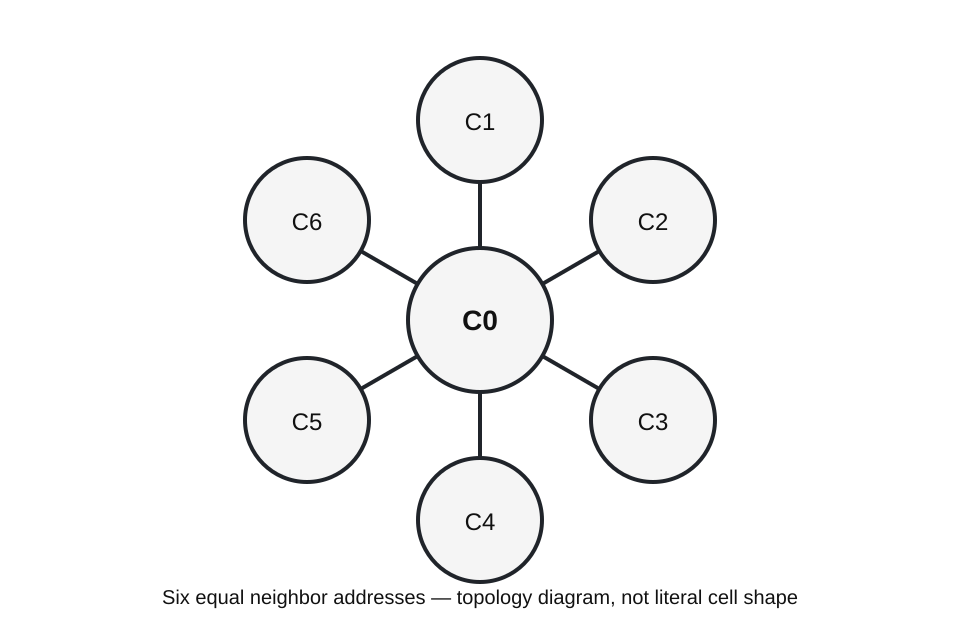
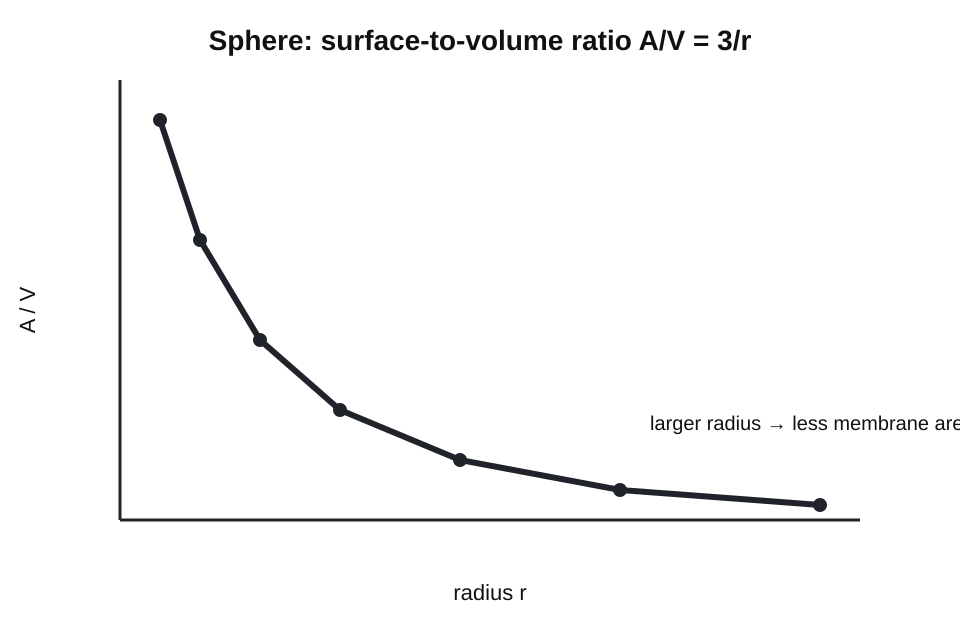

# ONE-WAVE FRAMEWORK
## Book 2 — Small
## Chapter 1: The Cell — Boundary, State, and Signal

**Status:** GRAY/GREEN reference + YELLOW One-Wave mapping  
**Spine:** Gray / 2D / 3D / Mathematics / Predictions / Yellow Audit / Future Work / Closing Thoughts  
**Primary One-Wave dependencies:** A-104 Gradient, A-108 Local Stability, A-110 Oscillation, A-111 Recursion, A-112 Persistent Mode  

---

## Gray — what biology already establishes

A biological cell is a bounded chemical system maintained away from equilibrium. The plasma membrane separates an internal state from an external environment while remaining selectively permeable. Cells maintain concentration gradients, exchange matter and energy, regulate reactions, store information, and respond to signals.

A cell is **not** generally hexagonal. Isolated cells often round when surface tension dominates; epithelial cells can form polygonal tilings; plant cells are constrained by cell walls; many tissues have irregular geometries. A regular hexagon is useful here only as an idealized **2D neighborhood/tiling diagram**, not as a universal biological cell shape.

That distinction matters because the circle, not the hexagon, minimizes perimeter for a fixed area in the plane:

$$
P_{\mathrm{circle}}=2\sqrt{\pi A}.
$$

A regular hexagon of side length $s$ has

$$
A_{\mathrm{hex}}=\frac{3\sqrt{3}}{2}s^2,
\qquad
P_{\mathrm{hex}}=6s.
$$

The hexagon earns its place because regular hexagons tile the plane without gaps while giving six equal nearest-neighbor directions.

## 2D — bookkeeping picture

For Book 2, use the regular hexagon as an **addressing primitive**. A center cell $C_0$ can be given six planar neighbor slots $C_1\ldots C_6$. The drawing says where interactions may be registered; it does not claim membranes are literal hexagons or that tissue must adopt this geometry.

A scalar state $u_i(t)$ attached to each cell can represent any explicitly named measured quantity: membrane voltage, concentration, fluorescence intensity, pressure proxy, or a normalized simulation variable. Neighbor exchange can then be written without importing a new physical law:

$$
\frac{du_i}{dt}=F_i(u_i,t)+D\sum_{j\in N(i)}(u_j-u_i).
$$

Here $F_i$ is the local source/sink rule and $D$ is an exchange coefficient. This is a generic coupled-system form. A One-Wave interpretation has to earn any more specific identification by matching data.

## 3D — boundary and volume

In three dimensions the cell is treated first as a closed boundary around a changing internal state. For an ideal sphere,

$$
A=4\pi r^2,
\qquad
V=\frac{4}{3}\pi r^3,
\qquad
\frac{A}{V}=\frac{3}{r}.
$$

That surface-to-volume ratio is a real scaling constraint: as a cell grows, volume rises faster than membrane area. It is a clean reason that transport and geometry matter before any One-Wave interpretation is added.

## Mathematics — gradients, flux, voltage, and threshold

For a concentration field $c(\mathbf{x},t)$, ordinary diffusion is described by Fick's law:

$$
\mathbf{J}=-D\nabla c,
$$

and, when $D$ is constant and there are no reactions,

$$
\frac{\partial c}{\partial t}=D\nabla^2c.
$$

Across a membrane with effective permeability $P_m$, a simple linear flux approximation is

$$
J_m=P_m(c_{\mathrm{out}}-c_{\mathrm{in}}).
$$

For electrical state, membrane potential is a measurable voltage difference,

$$
V_m=V_{\mathrm{inside}}-V_{\mathrm{outside}}.
$$

A threshold event can be represented abstractly as

$$
q(t)=
\begin{cases}
1,&u(t)\ge u_{\mathrm{th}},\\
0,&u(t)<u_{\mathrm{th}}.
\end{cases}
$$

That equation is bookkeeping, not proof that biological firing equals a One-Wave primitive.

## One-Wave mapping under test

The safest current mapping is functional rather than anatomical:

- **Gradient:** A-104 supplies language for state differences across space.
- **Local stability:** A-108 supplies language for a state remaining bounded around a viable region.
- **Oscillation:** A-110 is relevant when a measured cellular variable actually oscillates.
- **Recursion:** A-111 is relevant when the next state depends on the current and prior state.
- **Persistent mode:** A-112 is a candidate description for a maintained pattern, but the biological identification remains a hypothesis.

The mapping is only strengthened if the same equation predicts measured cellular behavior better than an appropriate conventional control model.

## Predictions / tests

1. **Geometry control:** hexagonal, square, and disordered six-neighbor graphs with matched degree should be compared. If the result depends only on degree, the hexagonal picture is presentation, not mechanism.
2. **Gradient control:** fit diffusion/transport data first with the standard diffusion equation. A One-Wave extension must reduce residuals without hiding extra free parameters.
3. **Threshold control:** compare a continuous response model with a threshold model on the same data; do not assume thresholding because the vocabulary contains a threshold.
4. **Persistence test:** define a measurable lifetime, amplitude, and decay law before calling a cellular pattern a Persistent Mode.

## Yellow Audit

- Hexagonal addressing is a diagrammatic lattice choice, not established universal cell geometry.
- A-104/A-108/A-110/A-111/A-112 provide candidate cross-scale language; biological equivalence is not yet demonstrated.
- No numerical One-Wave cellular parameters are calibrated in this chapter.
- Standard diffusion, membrane transport, electrophysiology, and reaction kinetics remain the controls that any proposed extension must beat or reproduce.

## Future Work

1. Add raw diffusion and membrane-voltage control datasets.
2. Run square/hex/disordered graph controls at matched connectivity.
3. Fit one explicit recursive state equation to one measured cellular process.
4. Promote only the mapping that survives those comparisons.

## Closing Thoughts

The useful starting point is simple: a cell has a boundary, an internal state, gradients across that boundary, and history-dependent regulation. Those are measurable facts. Book 2 can ask whether One-Wave primitives compress that behavior into a reusable description, but the book should never turn a convenient drawing into biology by declaration.
