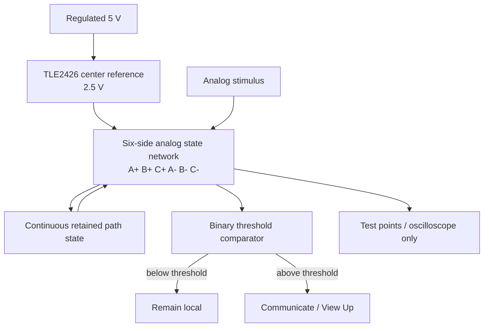

# CELL_V1 — Analog Brain Cell V1 Build

**Status:** authoritative first physical cell build

**Purpose:** prove one low-current analog cell in which the processing path itself retains history, so repeated use changes the next pass. This is the first brain-cell experiment. It is deliberately separated from the later three-winding motor-control build.

---

## 0. Do not drift these rules

1. The physical cell is a **hexagon**.
2. Connections are on the **six sides/edges**, never the corners.
3. The fixed clockwise side order is:

```text
A+ -> B+ -> C+ -> A- -> B- -> C- -> A+
```

4. Across-cell mirror relationships are:

```text
A+ <-> A-
B+ <-> B-
C+ <-> C-
```

5. Clockwise order is the scalable perimeter order. Across-hex relationships are the mirrors. Do not redraw the cell as three adjacent +/- pairs.
6. First supply is regulated **5 V** with a **2.5 V center/reference**.
7. The center/reference is not a third polarity.
8. **Processing = retained path change = muscle memory = reinjection into the next pass.** Do not split these into three unrelated subsystems.
9. The first brain cell is low-current and analog. Do not add the motor power stage to this build.
10. Duplicate only after one real cell passes the staged tests below.

---

## 1. Physical top view

```text
                         A+
                    __________
                 /              \
              C-                  B+
             /                      \
            |         CENTER         |
            |         2.5 V          |
             \                      /
              B-                  C+
                 \______________/
                        A-
```

Clockwise from the top side:

```text
A+ -> B+ -> C+ -> A- -> B- -> C-
```

Mirror axes through the center:

```text
A+ -------- CENTER -------- A-
B+ -------- CENTER -------- B-
C+ -------- CENTER -------- C-
```

The six side states are continuous analog states. They are not six independent digital gates.

---

## 2. What Brain Cell V1 must prove

The first cell is successful only if this physical recursion is measurable:

```text
existing path state
        |
        v
new analog input traverses the cell
        |
        v
current/voltage distribution is shaped by existing state
        |
        v
processing changes the stateful path
        |
        v
changed state persists after the stimulus stops
        |
        v
same later input encounters a changed path
        |
        +-------------------------------> next pass
```

In this build:

```text
PROCESSING
    =
PHYSICAL PATH CHANGE
    =
MUSCLE MEMORY
    =
STATE REINJECTED INTO THE NEXT PASS
```

"Reinjection" does not mean creation of energy. It means the retained physical state of the previous processing cycle participates directly in the next cycle.

---

## 3. Functional block view



The comparator comes **after** the analog cell state. It provides the binary boundary; it does not turn the whole cell into a digital processor.

---

## 4. Build in parts — one stage at a time

Do not assemble all six sides at once. Each stage must pass before the next stage is added.

### PART 0 — Reference only

Build:

```text
5 V regulated supply
        |
        v
TLE2426
        |
        +---- 2.5 V CENTER / REFERENCE
```

Measure:

```text
TP0 = 0 V
TP1 = +5 V
TP2 = center/reference
```

**PASS:** TP2 remains approximately half the 5 V supply while the low-current test network is connected.

**STOP:** if reference moves enough to confuse later measurements, fix the reference stage before continuing.

---

### PART 1 — One mirrored analog path: A+ / A-

Build only one mirror axis first:

```text
A+ state element ---- analog test path ---- A- state element
             \           |           /
                  2.5 V reference
```

The exact state-device programming/read network must obey the chosen device's voltage/current limits. The state element must be current-limited.

Test sequence:

```text
1. Measure initial A+ and A- state.
2. Apply a repeated low-current stimulus favoring one route.
3. Remove the stimulus.
4. Measure A+ and A- again with a non-destructive read condition.
5. Reapply the same weak test stimulus used before training.
```

**PASS:** repeated use creates a persistent, measurable difference and the later identical weak input responds differently because of the previous processing.

This is the smallest proof of the proposed muscle-memory/process loop.

---

### PART 2 — Complete the six-side perimeter

After Part 1 passes, add the other four side-state elements in the locked perimeter order:

```text
A+ -> B+ -> C+ -> A- -> B- -> C- -> A+
```

Do not change physical order to simplify wiring.

Measure all six side states against the same reference.

Mirror comparisons remain:

```text
A+ vs A-
B+ vs B-
C+ vs C-
```

**PASS:** all three mirrored relationships can be stimulated and measured without destroying the 2.5 V reference or corrupting an untouched pair.

---

### PART 3 — Binary threshold / signal-up boundary

Add an analog comparator stage. Current bench choice: **LM339B** or validated equivalent.

Logical job:

```text
analog cell state
      |
      v
compare with configured threshold/reference
      |
      +---- below threshold -> KEEP LOCAL
      |
      +---- above threshold -> COMMUNICATE UP
```

The binary layer does **not** choose a motor direction. In the brain cell it answers only whether the condition is significant enough to propagate.

If LM339B is used, remember that its output is open-collector and therefore requires the appropriate pull-up network.

**PASS:** a slowly changing analog state crosses the boundary cleanly and repeatedly without corrupting the cell state.

---

### PART 4 — Verify processing/memory/reinjection as one loop

Now repeat a route enough times to alter its analog state and observe the next pass without rewriting the state from software.

```text
PASS 1
input -> route -> physical state changes

PASS 2
same input -> encounters changed route -> response changes

PASS 3...
continued use -> route bias changes further within safe limits
```

Required measurements:

- state before training;
- state during repeated use;
- state immediately after use;
- state after a rest interval;
- response to the same weak input before and after training.

**PASS:** previous physical processing alters later physical processing without a CPU, software memory, lookup table, or externally restored state.

---

### PART 5 — View Up output

Only after Parts 0–4 pass, expose a compact output for another cell/cluster to observe.

```text
CELL ANALOG STATE
       |
       v
BINARY THRESHOLD
   /          \
local       View Up
```

This is the first cell-to-cluster interface. Do not build M4 here yet.

---

## 5. Locked threshold bands

The existing scale bands are preserved exactly:

```text
100-90
85-75
70-60
55-45
40-30
25-15
10-0
```

The inter-band gaps are also preserved exactly:

```text
89-86
74-71
59-56
44-41
29-26
14-11
```

Do not smooth, fill, renumber, or silently reinterpret them.

For this bench cell, the measured analog variable may be normalized to 0–100 for logging, but the exact physical meaning assigned to each band must be recorded with the experiment. The bands themselves are not to be reinvented during the build.

---

## 6. Test points

Use fixed names so every experiment can be compared with the previous one.

```text
TP0      = supply 0 V
TP1      = regulated +5 V
TP2      = 2.5 V center/reference

TPA+     = A+ state/read point
TPA-     = A- state/read point
TPA_DIFF = measured A mirror difference

TPB+     = B+ state/read point
TPB-     = B- state/read point
TPB_DIFF = measured B mirror difference

TPC+     = C+ state/read point
TPC-     = C- state/read point
TPC_DIFF = measured C mirror difference

TP_BIN   = binary threshold output
TP_VIEW  = compact signal-up/View-Up output
```

Every analog measurement must state whether it is measured relative to TP0 or TP2.

---

## 7. What is proven hardware practice vs what CELL_V1 is testing

### Established building-block behavior

- A 5 V supply can be split to a 2.5 V analog virtual-ground/reference with a TLE2426-class rail splitter.
- Analog comparators can create a repeatable threshold output from continuous analog input; LM339B provides four comparator channels and open-collector outputs.
- Real memristive/stateful conductance devices can retain programmable conductance and can be tested with pulse/read cycles when kept inside their device limits.

### CELL_V1 experimental claims to test

- six stateful perimeter positions in the locked clockwise hex geometry;
- three across-cell mirror comparisons A, B, and C;
- repeated traversal becoming a persistent route bias useful as the cell's muscle memory;
- that retained route state participating directly in the next processing pass;
- analog state feeding a binary local-vs-upward threshold without destroying the state;
- later scaling of the same primitive into pathway, cluster, M4, brain, and motor-control structures.

The building blocks being known does **not** prove the combined CELL_V1 behavior. That is what this build is for.

---

## 8. Brain cell is not the motor cell

Do not put the three-winding power stage into Brain Cell V1.

Current architecture separation:

```text
BRAIN CELL V1
analog processing + retained path state + threshold

PATHWAY / CLUSTER
cell-to-cell routing and local aggregation

M4
working physical hypothesis: 2 x 2 x 2 = 8 flowers
plus inverted/mirrored 2 x 2 x 2 = 8 flowers
4 + 4 stack inside each eight
logical job remains quadratic Views Up / Actions Down

MOTOR UNIT
one independent motor has its own three-winding local power stage

MOTOR CLUSTER
coordinates multiple local motor units
```

For motor/body implementation, ternary is the **three-winding motor-control stage**. Do not retrofit that high-current motor stage into this low-current brain-cell proof.

---

## 9. Hard stop / duplication rule

Do not duplicate CELL_V1 just because the schematic looks plausible.

One Brain Cell V1 must first establish:

```text
STABLE 2.5 V REFERENCE
+
MEASURABLE ANALOG STATE
+
REPEATED USE CHANGES THE PATH STATE
+
THE CHANGE PERSISTS
+
THE SAME LATER INPUT RESPONDS DIFFERENTLY
+
BINARY THRESHOLD CAN READ THE STATE WITHOUT DESTROYING IT
```

If one stage fails three times by the same approach, change the test angle instead of layering more circuitry onto the failure.

---

## 10. Reference component documentation

- Texas Instruments TLE2426 product/datasheet: https://www.ti.com/product/TLE2426
- Texas Instruments LM339B product/datasheet: https://www.ti.com/product/LM339B
- Knowm memristor FAQ / Discovery platform: https://knowm.org/memristors/memristor-faq/
- Knowm device datasheet: https://knowm.org/downloads/Knowm_Memristors.pdf

The exact stateful device for the final breadboard is deliberately listed as TBD in the parts file until its package, safe programming/read conditions, and availability are locked.