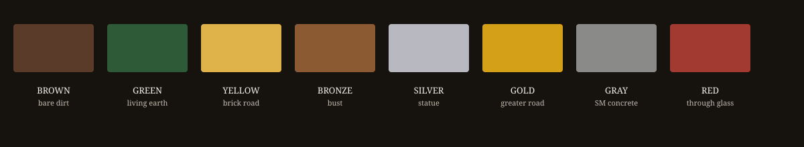

# I-02a — The Brick System reading

Full plate and law: [THE_BRICK_SYSTEM.md](THE_BRICK_SYSTEM.md)

| Brick | What it is | What it is not |
|---|---|---|
| BROWN | Bare dirt. Thought experiment. | A foundation. |
| GREEN | Living earth. Ready to grow. | A harvest. |
| YELLOW | Yellow brick road. Exploratory math. | The city. Do not get too excited. |
| BRONZE | Bust. First likeness. | A statue. |
| SILVER | Statue. Stands twice. | The golden road. |
| GOLD | Golden road. Greater proof. | Permission to rewrite Gray. |
| GRAY | SM view on concrete. Looks done. Stops drift. | Growth. |
| RED | Brick through the glass house of SM assumptions. | A derivation. |

Gray is concrete so the Standard Model cannot wander inside this repo.  
Red is glass-break, and only after `E(x,r)` already happened.
