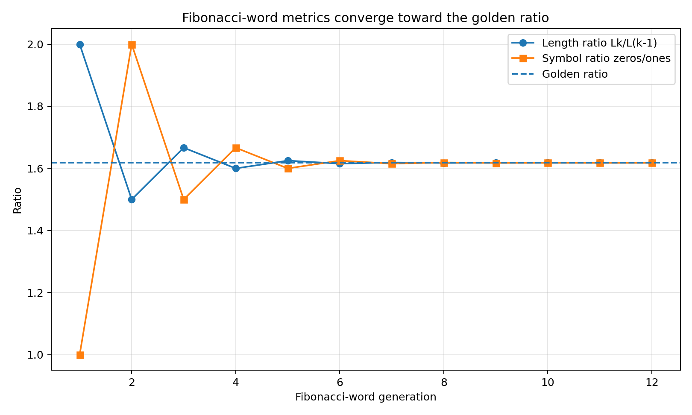

# Node G-721a: Fibonacci Word Hop Validation

**Parent:** G-721 Mirrored Alphabet Rabbit-Hop Coordinate Algorithm

**Dependencies**  
Upstream: G-706 Validation, G-712 Evaluation Mathematics, G-721 Mirrored Alphabet Rabbit-Hop Coordinate Algorithm  
Lateral: A-117 Dimensional Integrity, G-720 No Control But Self-Control  
Downstream: G-721b Sturmian generalization, Wave Computer route tests, Android procedural-memory tests, subconscious navigation tests

## Purpose

This node uses one declared Fibonacci-word convention as a fixed regression validator for the ordered even/odd recursive-branch trace produced by G-721. It is a special Sturmian case, not the complete rabbit-routing family.

It does **not** apply the golden ratio to the triangular/hexagonal lattice, the 6:1 / 12:1 / 24:1 dimensional architecture, arbitrary alphabet values, or unrelated simulation outputs.

The governing rule is

\[
\boxed{\text{Fibonacci word}=\text{ordered hop validation grammar}}
\]

\[
\boxed{\varphi=\text{long-run metric of that grammar}}
\]

The golden ratio does not generate the alphabet packet and does not make the live choice.

## Symbol Separation

Use the symbols \(f_0\) and \(f_1\) for the two Fibonacci-word tokens.

They are not:

- the Mirror Gate \((0)\);
- the live-choice values \(-1,0,+1\);
- alphabet letters A or B;
- binary permission states;
- physical particles or lattice cells.

They label the two recursive packet branches:

\[
f_0\leftrightarrow 2n,
\qquad
f_1\leftrightarrow 2n+1.
\]

For a recorded rabbit-hop coordinate \((n_t,r_t)\), recover the token as

\[
b_t=|r_t|-2|n_t|.
\]

The record is valid only when

\[
b_t\in\{0,1\}.
\]

## Fibonacci Word Convention

This repository uses the convention

\[
W_0=f_0,
\qquad
W_1=f_0f_1,
\]

\[
\boxed{W_k=W_{k-1}W_{k-2}\quad(k\ge2)}.
\]

The first finite words are

```text
W0 = 0
W1 = 01
W2 = 010
W3 = 01001
W4 = 01001010
W5 = 0100101001001
```

The infinite limit begins

```text
0100101001001010010100100101001001...
```

This convention must be stored with every validation result. Other conventions may be mathematically equivalent after reversal, symbol exchange, or seed change, but they may not be silently mixed.

## Why Fibonacci Number Properties Appear

Let

\[
L_k=|W_k|.
\]

Then

\[
L_k=L_{k-1}+L_{k-2}.
\]

With the convention above,

\[
L_k=F_{k+2}.
\]

If \(Z_k\) and \(O_k\) are the counts of \(f_0\) and \(f_1\) in \(W_k\), then

\[
Z_k=F_{k+1},
\qquad
O_k=F_k.
\]

Therefore

\[
\frac{L_k}{L_{k-1}}\rightarrow\varphi,
\qquad
\frac{Z_k}{O_k}\rightarrow\varphi,
\]

where

\[
\varphi=\frac{1+\sqrt5}{2}.
\]

The golden-ratio alignment is therefore a consequence of the ordered Fibonacci-word construction. A random pair of values near \(1.618\) is not equivalent evidence.

## Validation Metric 1: Packet Legality

For each hop record, compute

\[
b_t=|r_t|-2|n_t|.
\]

Define

\[
I_t=
\begin{cases}
1,& b_t\in\{0,1\},\\
0,& \text{otherwise}.
\end{cases}
\]

The route fails immediately if any \(I_t=0\).

## Validation Metric 2: Fibonacci-Word Prefix Error

Let

\[
\mathbf b=(b_0,b_1,\ldots,b_{N-1})
\]

be the branch trace in its original committed order, and let

\[
\mathbf w^{(N)}
\]

be the first \(N\) tokens of the canonical infinite Fibonacci word.

Define the normalized mismatch

\[
\boxed{
\epsilon_W(N)
=
\frac{1}{N}
\sum_{t=0}^{N-1}
\mathbf 1[b_t\ne w_t]
}.
\]

Interpretation:

- \(\epsilon_W=0\): exact canonical prefix;
- \(0<\epsilon_W\ll1\): approximate alignment only;
- large \(\epsilon_W\): no Fibonacci-word match.

No token may be deleted, inserted, reordered, or complemented after inspection to reduce \(\epsilon_W\).

## Validation Metric 3: Recursive Block Identity

When the trace is generated or segmented into finite words, verify

\[
\boxed{W_k=W_{k-1}W_{k-2}}.
\]

Define

\[
R_k=
\begin{cases}
1,& W_k=W_{k-1}W_{k-2},\\
0,& \text{otherwise}.
\end{cases}
\]

An exact Fibonacci-word claim requires \(R_k=1\) for every tested generation.

## Validation Metric 4: Length and Count Recurrence

Verify

\[
L_k-L_{k-1}-L_{k-2}=0,
\]

\[
Z_k-Z_{k-1}-Z_{k-2}=0,
\]

\[
O_k-O_{k-1}-O_{k-2}=0.
\]

These integer recurrences are stronger than a decimal ratio coincidence.

## Validation Metric 5: Golden-Ratio Alignment

For generations with nonzero denominators, record

\[
q_k^{(L)}=\frac{L_k}{L_{k-1}},
\qquad
q_k^{(C)}=\frac{Z_k}{O_k}.
\]

Use normalized errors

\[
\epsilon_{\varphi}^{(L)}(k)
=
\frac{|q_k^{(L)}-\varphi|}{\varphi},
\]

\[
\epsilon_{\varphi}^{(C)}(k)
=
\frac{|q_k^{(C)}-\varphi|}{\varphi}.
\]

For exact finite Fibonacci words, the ratios approach \(\varphi\) from alternating sides. A validation report must retain the full ordered convergence series rather than only the closest generation.

## Validation Metric 6: Balance and Aperiodicity Checks

Golden-ratio count alignment alone does not prove Fibonacci-word order. Two additional checks are therefore recommended.

### Balance

For any two factors of equal length, the number of \(f_1\) tokens differs by at most one.

A violation disproves exact Fibonacci-word structure.

### Factor complexity

For factor length \(m\), the infinite Fibonacci word has

\[
p(m)=m+1
\]

distinct factors. This is the minimal complexity of an aperiodic binary word.

A periodic alternating pattern, shuffled trace, or count-matched random word may pass a crude ratio test while failing these order-sensitive checks.

## Mirror and Reverse Validation

### Sign mirror

For

\[
(n_t,r_t)\mapsto(-n_t,-r_t),
\]

the recovered token is invariant:

\[
|-r_t|-2|-n_t|=|r_t|-2|n_t|=b_t.
\]

Therefore the positive and negative mirrored paths must produce the same Fibonacci-word trace.

### Reverse traversal

A reversed route produces

\[
\operatorname{rev}(\mathbf b).
\]

It must be compared with the reversed expected prefix

\[
\operatorname{rev}(\mathbf w^{(N)}),
\]

not with the forward prefix.

Reversal does not imply token complement.

## Relationship to Foundational Choice

The Fibonacci word is a validator or stored route grammar. It is not the bottom-up chooser.

The correct architecture is

```text
live -1(0)+1 choice
-> committed even/odd recursive branch
-> recorded branch trace
-> Fibonacci-word validation
-> binary top-down allow / block / flag
```

The validator may report mismatch, deny an exact-route claim, or request correction. It may not manufacture a movement that the live choice did not commit.

## What This Node Does Not Validate

This node does not validate:

- 2D triangular or hexagonal geometry;
- the seven-cell cluster;
- Flower-of-Life or Metatron-style overlays;
- 3D 12:1 coordination;
- 4D 24:1 recurrence;
- proton, quark, Mass-Effect, or Mirror-Gate physics;
- arbitrary ratios between alphabet indices;
- the fact that the alphabet has 26 letters;
- the 53-value signed/null address count.

The relations \(2n\) and \(2n+1\) define recursive packet branches. They are not themselves Fibonacci recurrence.

## Mandatory Validation Record

Every run must store:

```text
validator version
Fibonacci-word seed convention
source word or route identifier
original letter order
mirror layout
forward or reverse traversal
letter indices n_t
selected recursive coordinates r_t
recovered branch trace b_t
expected Fibonacci prefix
packet-legality result
prefix mismatch epsilon_W
finite-word generation checks R_k
length and symbol counts
length-ratio convergence
symbol-count-ratio convergence
balance result
factor-complexity result when tested
exact / aligned / weak / fail classification
```

## Classification Rule

### Exact Fibonacci-word route

Requires:

- legal packets;
- zero prefix mismatch;
- exact recursive block identities;
- exact length and count recurrences;
- mirror/reverse checks passed.

### Golden-ratio aligned route

May be reported when the ordered count or length ratios converge toward \(\varphi\), but the exact word-order checks do not all pass.

This classification is weaker and must not be called an exact Fibonacci word.

### Weak resemblance

One or two ratios happen to lie near \(\varphi\), without ordered convergence or word checks.

This is not validation.

### Fail

Packet illegality, reordered data, convention mixing, or significant word mismatch.

## Reference Convergence Graph



The graph is generated from the exact finite-word receipts. It is a validator visualization, not an independent physical simulation.

## Reference Implementation

The directory `Nodes/G-721a_Validation/` contains:

- `fibonacci_word_validator.py`;
- `fibonacci_word_generations.csv`;
- `alphabet_route_reference.csv`;
- `reference_validation.json`;
- `fibonacci_word_convergence.png`;
- `README.md`.

The reference run compiles A through Z using the first 26 canonical Fibonacci-word tokens, verifies the negative sign mirror, verifies reverse traversal against the reversed expected word, and records the convergence receipts.

## Falsifiers

The One-Wave use of this validator must be revised or rejected when:

1. the branch trace cannot be recovered unambiguously from \(n,2n,2n+1\);
2. mirror or reverse operations alter tokens contrary to the declared grammar;
3. exact-word claims fail the recursive block identity;
4. ratio alignment survives only after reordering or selecting terms;
5. the validator begins driving live choice instead of checking committed choice;
6. Fibonacci-word language is used to promote unrelated lattice or physical claims.
