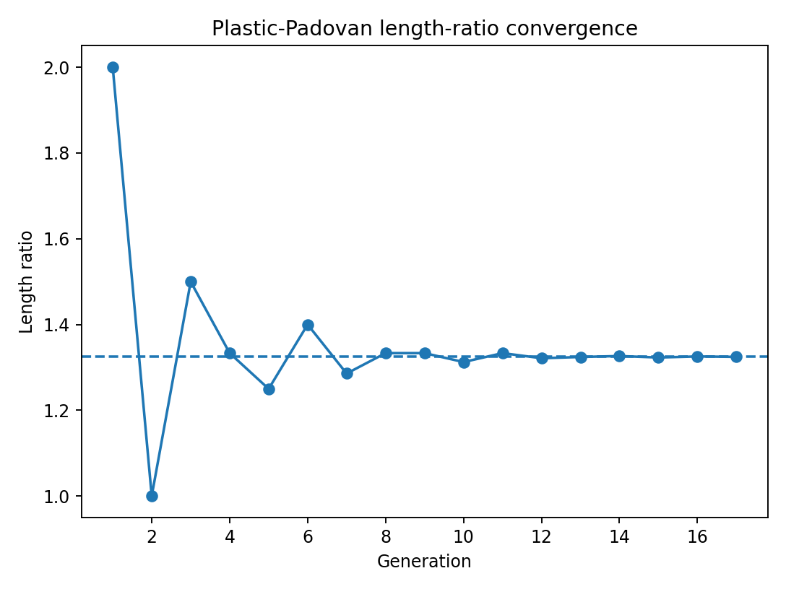

# Node G-721e: Plastic-Padovan Three-Rail Grammar

**Dependencies**  
Upstream: G-721 Mirrored Alphabet Packet, G-721b Sturmian Branch Grammar  
Lateral: G-723 Spectral Audit  
Downstream: three-rail rabbit tests, Android procedural-route experiments

## Three Alphabet Rails

For letter index `n`, define the retained packet rails

\[
I_n=n,\qquad E_n=2n,\qquad O_n=2n+1.
\]

Here `I`, `E`, and `O` mean identity/reference, even recursive rail, and odd recursive rail. They are not physical particles or binary truth values.

## Plastic Substitution Candidate

Use the ternary substitution

\[
\boxed{I\mapsto EO,\qquad E\mapsto I,\qquad O\mapsto E}.
\]

With columns ordered `I,E,O`, its incidence matrix is

\[
M_P=
\begin{pmatrix}
0&1&0\\
1&0&1\\
1&0&0
\end{pmatrix},
\]

with characteristic polynomial

\[
\boxed{x^3-x-1}.
\]

The dominant real root is the plastic number

\[
\rho\approx1.324717957.
\]

Its other two conjugates lie inside the unit circle, making `rho` a Pisot number.

## Padovan Length Recurrence

Let `W_m` be the `m`th substitution word and `L_m=|W_m|`. After seed convention is declared, the lengths obey the Padovan-type recurrence

\[
\boxed{L_{m+3}=L_{m+1}+L_m},
\]

and successive ratios converge to `rho`.

The exact initial terms depend on seed and indexing and must be stored with every receipt.

## Candidate One-Wave Interpretation

The substitution may test an ordered three-rail return grammar:

```text
identity opens recursive availability
odd returns through even
even returns to identity
```

This is a proposed mapping, not a theorem of plastic-number dynamics.

For active rail symbol `s_t`, map

\[
R(n_t,s_t)=
\begin{cases}
n_t,&s_t=I,\\
2n_t,&s_t=E,\\
2n_t+1,&s_t=O.
\end{cases}
\]

Foundational choice then gives negative movement, hold, or positive movement along the selected route.

## Relationship to Sturmian/Fibonacci

- the plastic substitution schedules all three retained rails `I/E/O`;
- Sturmian/Fibonacci structure may separately validate the binary `E/O` branch when that subproblem is active;
- neither validator replaces live choice.

## Required Tests

- exact substitution receipts;
- characteristic polynomial and eigenvalues;
- Padovan length recurrence;
- route-symbol frequencies;
- recurrence gaps;
- forward/reverse and sign-mirror consistency;
- comparison with Tribonacci, periodic, random, and learned schedules;
- motor-task performance when used downstream.

## Falsifiers

Reject this mapping if the three-rail interpretation adds no predictive or control value, if it cannot preserve all packet rails without ambiguity, or if the claimed Padovan recurrence depends on undeclared seed manipulation.

## Reference Receipts



`Nodes/G-721_Sequence_Validation/` stores the exact generation table and validator. The receipt validates the substitution and length recurrence only.
