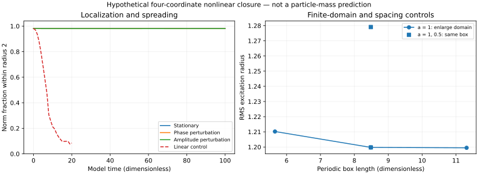

# Excitations and measurements: localized bulk candidate

The numerical question is now: **does a localized excitation of the coupled field persist, and what do specified detectors measure from it?** No particle bead, particle count, flavor label, mass target or forced boundary crossing is inserted.

Run from the repository root:

```sh
python -m pip install numpy scipy
python solvers/test_bulk_excitation.py
python solvers/run_bulk_excitation.py > solvers/bulk_excitation_results.json
# Optional measured-output figure:
python -m pip install matplotlib
python solvers/plot_bulk_excitation.py
```

[Solver](bulk_excitation.py) · [Tests](test_bulk_excitation.py) · [All controls and traces](bulk_excitation_results.json).



## Result and scope

With one fixed coefficient set and conserved norm N=20, the native FCC12 experiment finds a stationary localized excitation on a periodic bulk lattice. There is no enclosing reflecting cavity or imposed potential well. Periodic images remain and are checked separately by increasing the domain.

The 864-site branch has Euler–Lagrange residual 4.38e-8, energy −7.522746, RMS radius 1.199749 and 98.0963% of norm within radius 2. The equal-norm uniform branch has energy −0.591892. Thus this localized branch has lower energy than that particular uniform branch; this does not prove a global minimum.

Over 100 dimensionless time units, the unperturbed branch has phase-aligned state error 1.13e-5. Two-percent random phase and amplitude perturbations retain more than 98.06% of norm inside radius 2 at the final sample. Maximum relative norm error is below 5.77e-12 without per-step renormalization; maximum relative energy error is below 8.58e-8. This is finite-time persistence evidence, not asymptotic stability or relaxation: the conservative system does not damp perturbations away.

The same initial profile in the linear control retains only 8.46% in that region by time 20. This demonstrates the effect of the declared nonlinear closure rather than an enclosing wall holding a linear cavity mode.

**Important failure of full architectural closure:** localization survives when cross and phase-lock couplings are removed. The ablated branch places almost all norm in one response coordinate. Coupling is necessary for the reported four-role participation, but this candidate does not demonstrate that all four roles are necessary for localization. It therefore does not close C-318's load-bearing four-interaction Mass Effect requirement.

## Native dimension and reference

| Declaration | Actual implementation |
|---|---|
| Native dimension | Three spatial dimensions; evolving complex state history |
| Native coordination | D-409 FCC shell: twelve directed neighbors, six opposite pairs |
| Sites | Cartesian integer triples with even parity |
| Neighbor offsets | (±1,±1,0), (±1,0,±1), (0,±1,±1) |
| Positions | a/√2 times the integer triple |
| Volume per site | ΔV=a³/√2 |
| Boundary | Even-period periodic torus; no enclosing reflecting wall |
| Ground | ψ=0, responsive zero input |
| Center | Density maximum for localization; fixed origin for detector windows |
| Projection | None in the numerical measurements; figure plots scalar summaries |
| Omitted degrees | Displacement/velocity and nonlinear geometric weave are not derived; no three-vortex topology |
| Recurrence | Full field evolution modulo declared global phase; no claimed D-410 24-position Mirror history |

FCC and HCP longer-range stacking are not equated. The 2D six-neighbor layer remains distinct.

## Explicit hypothetical closure

This is an **additive first-order complex-field constitutive hypothesis**. It is not derived from, and does not replace, the canonical second-order memory recurrence or the previous joint response control. The coefficients are declared test inputs, not independently derived physical constants.

At each site ψ=(ψK,ψE,ψM,ψT) contains four coupled response coordinates. Let R be the four-role cycle Laplacian, C=diag(s)+cR and ρi=Σa αa|ψia|². For undirected FCC bonds,

\[
E=\Delta V\left[
\frac{1}{12a^2}\sum_{\{i,j\}}(\psi_i-\psi_j)^\dagger C(\psi_i-\psi_j)
+\kappa\sum_i\psi_i^\dagger R\psi_i
-\frac{g}{2}\sum_i\rho_i^2
+\frac{h}{3}\sum_i\rho_i^3\right],
\quad N=\Delta V\sum_i\|\psi_i\|^2.
\]

Defaults: s=(1,0.8,1.2,0.6), c=0.12, κ=0.04, α=(1,0.9,1.1,0.8), g=2, h=1. The negative quartic favors concentration while the positive sextic limits amplitude growth. This is a nonlinear self-localization test, **not a scalar-potential mass-gap derivation**. No inertia is assigned from the potential curvature or the frequency.

E and N both include cell volume. Freezing site-sum norm instead of N under spacing refinement would change the density and invalidate comparison.

The hypothesized evolution is

\[
i\dot\psi_i=\frac1{\Delta V}\frac{\partial E}{\partial\psi_i^*}
=\frac{(L\psi)_i C}{12a^2}+\kappa\psi_iR
+\alpha(-g\rho_i+h\rho_i^2)\psi_i.
\]

Hermiticity and the global phase symmetry conserve norm; the Hamiltonian flow conserves E. The code's complex directional derivative test independently checks its energy gradient.

## Stationary excitation and numerical evolution

At fixed N, search real amplitude profiles through normalized L-BFGS parameters. Only the optimization uses this sphere parameterization. The resulting branch obeys gradient(q)=μq and generates ψ(t)=exp(−iμt)q. It is a valid stationary solution of the complex evolution, but the search does not enumerate complex phase textures, global minima or vortex states.

The base μ is −0.501885. A passive detector's coherent amplitude therefore rotates at phase slope −μ. The report also extracts phase slope 0.501885282 from the independently evolved detector trace, compared with −μ=0.501885124. This provides a measured excitation frequency, not a particle mass.

Time evolution uses Strang splitting: exact local nonlinear phase for half a step, exact joint Hermitian four-role Fourier propagator for a full step, then the remaining local half step. C and R need not commute; each Fourier 4×4 block is diagonalized jointly. Local ρ is fixed during its phase substep. No artificial norm reset or damping is added.

Energy error of the phase-perturbed run decreases from 3.012e-7 to 7.371e-8 to 1.833e-8 for dt=0.04,0.02,0.01 over time 10, consistent with second-order splitting. Norm is preserved to roundoff. A reversal test applies a positive step then its negative.

## Measurements, not separate objects

In the One-Wave interpretation, particle language identifies measured signatures or classifications of field excitations. The calculation evolves the excitation first and samples it through explicitly declared windows:

\[
A_a(t)=\Delta V\sum_i w_i\psi_{ia}(t),\qquad
I(t)=\Delta V\sum_iw_i\sum_a|\psi_{ia}(t)|^2.
\]

The report includes real/imaginary coherent amplitudes and intensities for fixed-origin radius-1 and radius-2 windows. Their outputs differ even though the underlying evolving field is the same. Global phase rotation changes coherent amplitude but leaves intensity invariant. Calling the output a measured excitation does not identify the output array with the complete field state.

These are passive numerical samplers under E-525, with no detector feedback. A physical detector is a coupled system with its own energy response; that forward model remains to be constructed. This experiment does not reproduce quantum counting statistics, Bell correlations or CERN event reconstruction. Detector intensity is not a calibrated energy in joules.

Localization uses a sphere centered at the current density maximum, whereas detector windows stay at the fixed reference origin. This distinction prevents confusing peak-tracking localization with a fixed-apparatus signal. The phase-aligned state error is evaluated in the original coordinates and does not recenter a drifting profile.

## Domain, spacing, pinning and failure controls

| Control | Observation | Consequence |
|---|---|---|
| Periodic sides 8,12,16 at a=1 | E=−7.549976,−7.522746,−7.522550; RMS radius=1.210206,1.199749,1.199475 | Large-domain differences decrease; outer-image fraction falls to 1.14e-6 |
| Same box and N, a=1→0.5 | E=−7.522746→−6.396714; radius=1.199749→1.279069 | About 15% energy change; continuum convergence remains unresolved |
| Seed widths 0.7,1.5,2 | Same site-centered branch within numerical residual | Not dependent on one chosen Gaussian width |
| Half-bond shifted seed | Distinct E=−7.430802 stationary branch | Lattice pinning/metastability remain unresolved; no free-translation claim |
| N=2 | Uniform extended branch, only 6.37% in radius 2 | Candidate can fail localization; norm is a model input, not a particle number |
| N=5,10,20,40 | Localized branches with different widths/energies | No target flavors assigned; not a physical spectrum selection rule |
| Cross and phase coupling OFF | Localized single-coordinate branch persists | Full four-interaction confinement requirement not solved |

Finite periodic systems can recur after spreading. The linear control is reported over its stated window; it is not claimed incapable of every finite-box recurrence. Perturbed dynamics have been run at the base grid; continuum and larger-domain dynamical stability are not established by stationary-domain controls alone.

## Scientific context

Competing cubic focusing and quintic defocusing nonlinearities have existing discrete-soliton literature; this mathematical choice is not a new discovery or evidence for the One-Wave medium. For a primary 2D/3D precedent see *Multistable Solitons in Higher-Dimensional Cubic-Quintic Nonlinear Schrödinger Lattices*, [arXiv:0804.0497](https://arxiv.org/abs/0804.0497). The present FCC geometry, four-role control and measurement packet are explicit experiments to test; they are not inferred physical validation from that paper.

## Branch-step, Field/Void and retained consequence

- MAIN GOAL for this authorized science step: build reproducible excitation/measurement software that advances the One-Wave physical derivation.
- WHY: the previous response fixture used an imposed reflecting cavity; this tests nonlinear localization in periodic bulk.
- HARD START / reference: GitHub connector main 6fb0e2050a855afc9b09fbaa88a75a747ab49f35. Scratch execution root /workspace/scratch/a7e12a7cdae0/science-audit; not a laptop/Jetson checkout or remote execution claim.
- REFERENCES: General Reference Law, AI canonical start, Reality Database specification, A-112, A-117, C-317, C-318, D-408–D-413, E-525, I-06 and Book 1 Ch9/Ch14.
- ALLOWED: additive bulk solver, tests, runner, raw report and state-derived plot; focused excitation/measurement pointers in A-112/C-318/D-409/Ch14.
- PROTECTED: canonical recurrence, existing solvers, hardware/breadboard and device checkouts unchanged.
- FIELD: proposed a cubic-quintic hypothesis, included physical-volume-aware norm, implemented residual and measured-output controls.
- VOID PRE: CORRECT→ALLOW after separating the new first-order law, adding volume factors and preserving ablations/refinement limits.
- TESTS: ten bulk tests plus fifteen existing solver tests pass; full reports include finite dynamics, norm sweep, coupling ablation, domain and spacing changes.
- VOID POST: ALLOW tested candidate; required explicit real-amplitude search limits, survival of ablated localization, spacing and pinning gaps, detector/peak-center distinction and input validation. Repairs applied.
- ATTEMPT: 1/3 constructive approach. No physical target fitting. Conservation/residual failure would stop promotion.
- LOOK-BACK: a reproducible localized nonlinear excitation now exists; uniform and linear controls distinguish it; full four-role necessity and canonical-law closure still fail to follow.
- HARD STOP: publish finite candidate evidence; no physical mass, particle identification, vortex topology or continuum claim.
- NEXT PERMITTED STEP: derive the constitutive nonlinearity from the canonical update and geometric boundary/weave variables; require four-role necessity, native circulation, translation/force response, continuum controls and a real coupled detector before promotion.
