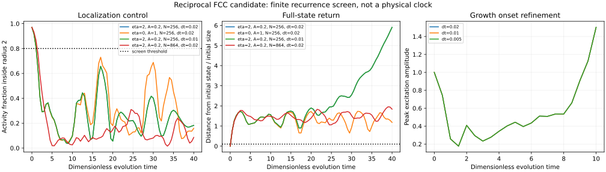

# Periodic excitation search: retained displacement candidate

**Result: no candidate passed this finite initial-value screen.** This is a
constraint on the specified law and seed family, not a nonexistence proof for
all time-periodic excitations or the complete One-Wave architecture.

Law reference: [native compression bridge](NATIVE_COMPRESSION_BRIDGE.md), pinned
at PR #193 commit `8e493c4f1d7d8bfba0eddd9ffc446fd31021b80b`.
Code identity: native_compression_bridge.py SHA256
`06b26242bd18e9e9015931744b7b580d053e3b1b22db3d9405a561d0968d0f07`.
Current main reference for authority checks:
`f1d13c2d3b68995a7cb5c6148ddd0c855ea87244`; AGENTS, General Reference Rules,
AI canonical start and Reality Database specification are unchanged from the
previous timing reference. The existing law, coefficients and metadata gates
are preserved. No physical mass or clock factor is assigned.

## Run

```sh
python solvers/periodic_compression_search.py > solvers/periodic_compression_results.json
python solvers/plot_periodic_compression.py
```

Requires NumPy and SciPy; plot requires Matplotlib. The script's exit zero means
the report was generated, not that localization or recurrence passed. Scientific
screen gates are stored independently for each run.

[Raw results](periodic_compression_results.json) ·
[Search code](periodic_compression_search.py) ·
[Measured-output plot](periodic_compression_controls.svg).



## Declared scope and measurements

The native periodic FCC graph has twelve neighbors at every active site. Initial
psi is an origin-centered Gaussian; displacement and both velocities start at
zero. Coefficients beta=shear=k=a_c=1 are fixed; eta=2 for coupled cases and eta=0
for the uncoupled control. Widths and amplitudes are seed inputs, not fitted
particle labels. No normalization reset, imposed well, trajectory constraint,
dynamic recentering or clock-rate factor is used.

The tested amplitudes are .2,.5,1,1.5 at width 1; an additional amplitude-1 seed
uses width .7. The uncoupled control uses amplitude 1,width 1. Each base run uses
256 active sites, dt=.02 and requested time 40. A maximum-state threshold of 50
stops extreme excursions; it is an execution guard, not a physical boundary.

Screen thresholds were declared before execution: complete time 40, scaled
energy drift below .005, excitation activity fraction inside radius 2 at least
.8 throughout the final quarter, and a sampled full-state return error at most
.1 after time 5. Return sampling occurs every .5 time units. Activity is
psi²+v_psi², a dimensionless diagnostic, not energy or conserved norm. Displacement
activity is measured separately. Full-state return includes psi, its velocity,
u and its velocity in the original coordinates, without phase alignment.
These thresholds screen possible candidates; they do not establish Floquet
stability or multiple repeated cycles.

## Base screen

| Seed amplitude | Width | eta | Actual end time | Max scaled energy error | Outcome |
|---|---|---|---:|---:|---|
| .2 | 1 | 2 | 40 | 2.80e-5 | Completed; localization and return fail |
| .5 | 1 | 2 | 22.22 | 11.05 | Threshold stop; energy control invalid |
| 1 | 1 | 2 | 12.62 | 2.31 | Threshold stop; energy control invalid |
| 1.5 | 1 | 2 | 8.52 | 1.27 | Threshold stop; energy control invalid |
| 1 | .7 | 2 | 20.40 | 8.51 | Threshold stop; energy control invalid |
| 1 | 1 | 0 | 40 | 1.99e-4 | Completed; localization and return fail |

The completed amplitude-.2 coupled run has minimum late localized fraction
.09611 and best sampled full-state return error .89765. The uncoupled control
has minimum late localized fraction .07566 and best return error .64996. Thus
neither periodic-box reassembly nor coupling alone meets the declared contract.
The high-amplitude endpoints cannot be promoted as physical instability rates
because their energy accounting has already failed.

## Refinement controls

The completed energy-controlled coupled run with greatest minimum late
localization was selected for refinement; this is explicit post-screen selection,
not an independent held-out physical test.

| Amplitude-.2 coupled control | Min late fraction | Best sampled return error | Max energy error |
|---|---:|---:|---:|
| 256 sites, dt=.02 | .0961104 | .897653 | 2.80386e-5 |
| 256 sites, dt=.01 | .0961290 | .897839 | 7.01018e-6 |
| 864 sites, dt=.02 | .0155001 | 1.059237 | 2.63026e-5 |

The timestep comparison supports numerical consistency over this window; the
larger box strongly changes localization. Finite-domain behavior remains
important, and neither box supports this tested seed as a self-held recurrence.
Spacing remains fixed; this is not a continuum-refinement test.

## Growth onset, distinct from invalid endpoints

To inspect growth before the amplitude-1 run loses energy control, repeat that
seed through time 10 with three timesteps:

| dt | Final peak amplitude | Final localized fraction | Max energy error |
|---|---:|---:|---:|
| .02 | 1.50204850 | .14186759 | 2.54515e-4 |
| .01 | 1.50234876 | .14181296 | 6.36284e-5 |
| .005 | 1.50242381 | .14179930 | 1.59074e-5 |

The measured onset and energy error converge under halving dt. This supports
the finite-time onset in that seed, not the later threshold-stop behavior or a
physical blow-up interpretation. Amplitude initially falls and subsequently
grows; the plot displays that actual trace rather than an assigned exponential.

## Evidence and limits to retain

Six base runs, two localization controls and three onset controls were executed
in the isolated scientific workspace. The existing ten-control native report
was rerun and reproduced exactly. The measured SVG was rendered and inspected.
This is not a claim that Jetson executed the scientific simulation.

Only displacement-free Gaussian seeds were searched. Nonzero velocity, phase
textures, other amplitudes and genuine periodic-orbit shooting remain unexplored.
Half-unit sampling can miss brief returns. No candidate qualifies for clock-rate,
translation or perturbation/Floquet testing. No four-role weave, detector,
physical calibration or proper-time prediction is added by this run.

## Branch-step record

MAIN GOAL: advance reproducible native excitation/measurement science.
WHY: the timing calculation needs a self-held periodic excitation, and the exact
candidate already excludes stable nontrivial static minima.
ALLOWED: additive search, raw report, plot and derivation plus one chapter pointer.
PROTECTED: existing candidate law, timing node, node gates, all prior solvers,
hardware and dirty device checkouts.
FIELD: finite fixed-law seed screen and measured state returns.
VOID: distinguish periodic-box return from confinement; do not normalize/recenter;
keep numerical energy failure separate from physical failure.
ATTEMPT: base screen 1/3; follow-up onset refinement checks validity without
changing the approach or retuning coefficients.
STATE: report complete; no periodic candidate found in this scope.
SCALE: do not promote to physical nonexistence, time dilation or particle claims.
LOOK-BACK: timestep refinement preserves completed-run failure; larger domain
weakens localization. This law/seed family does not supply the required clock.
NEXT: use phase/velocity-bearing initial states and a bounded periodic-orbit
search under the unchanged law, or derive a supported constitutive correction
from retained boundary/weave geometry. Do not keep searching static minima or
insert an artificial norm conservation to hide the present failure.
