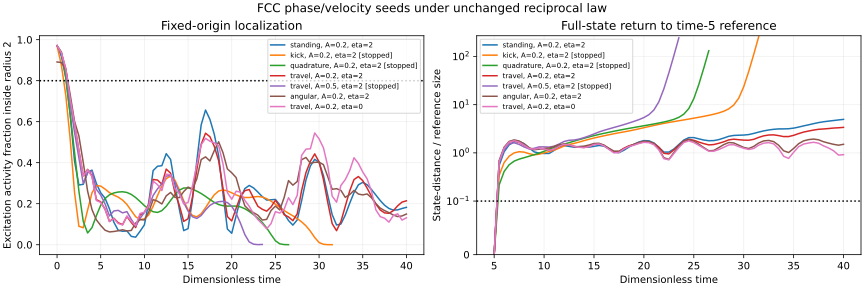

# Phase/velocity FCC recurrence search and Ground propagation bands

**Result: none of seven base cases qualifies as a self-held periodic excitation.**
Two refinement runs preserve that failure for the strongest completed coupled
seed. This finite search does not rule out every periodic orbit.

Reference: PR #193 at `7c1bd2f33f9b5ee0451b35913fd7a3607e90ba9d`.
Current main authority comparison: `a878e481c1354f6e3dc8d0a2e701808564ea8d86`;
AGENTS, General Reference Rules, AI canonical start and Reality Database
specification are unchanged from the previous cycle. The exact law and all
coefficients in [native_compression_bridge.py](native_compression_bridge.py)
are unchanged. Scientific execution is in the isolated workspace, not a claim
of a Jetson simulation run. No node gate is promoted.

## One-Wave operational names

Names follow [the repository terminology legend](../ONE_WAVE_TERMINOLOGY_LEGEND.md).

| Name | Meaning in this calculation | Qualification |
|---|---|---|
| Ground / Zero Field State | psi=u=chi=0, the reference state used for the linear propagation bands | A field state, not empty space or a negative-space layer |
| Excitation | A nonzero disturbance of psi with its retained displacement response u | A seed or measured disturbance; persistence is unproved |
| Persistent Mode candidate | A proposed bounded recurrence of the complete retained state | Must pass localization, recurrence and numerical controls; none has passed |
| Compression | chi=-div(u), with the unchanged native FCC discrete divergence | Not an independently assigned substance |
| Ground propagation band | Frequencies carried by the linearized field around Ground | A transport constraint, not a measured physical light-speed calibration |
| Mass Effect | Resistance to carrying and rebuilding a stable four-interaction recurrence relative to Ground | Not calculated here; the numerical kinetic normalization is not measured Mass Effect |

Boundary-Tension Weave, Vortex Phase, Knot Lock and Mirror remain names for their
defined One-Wave mechanisms. This reduced compression candidate has not implemented
the complete four-interaction recurrence. An angular scalar seed therefore does
not receive a Vortex Phase label, and localization alone would not establish Knot Lock.
Mathematical terms such as eigenvalue, phase, gradient and periodic orbit retain
their precise meanings. Code identifiers and stored measurement keys stay stable.

## Reproduce and inspect

```sh
python solvers/phase_velocity_search.py > solvers/phase_velocity_results.json
python solvers/plot_phase_velocity.py
```

[Search code](phase_velocity_search.py) · [Raw measurements](phase_velocity_results.json).
Requires NumPy/SciPy; plotting requires Matplotlib. Successful script exit means
the report was generated. Each scientific gate is recorded independently.



## Seed families and recurrence contract

All base cases use the native periodic FCC graph with 256 sites, dt=.02 and
duration 40. beta=shear=k=a_c=1 remain fixed. Coordinates use nearest periodic
displacement from the original center; localization is always measured there.

- Standing: Gaussian psi, zero excitation velocity and displacement.
- Kick: the same Gaussian with v_psi=.5 times its envelope.
- Quadrature: initially zero psi and Gaussian excitation velocity.
- Traveling quadratures: psi=envelope cos(x), v_psi=envelope sin(x).
- Angular quadratures: the envelope is multiplied by cylindrical radius,
  psi=envelope cos(theta), v_psi=envelope sin(theta).
- Relaxed displacement: where declared, solve the same constrained compression
  response from initial psi² before evolution; displacement velocity is zero.
- Uncoupled comparison: eta=0 for the amplitude-.2 traveling seed.

The prescribed sin/cos scale is an initial condition, not a derived temporal
frequency or conserved phase charge. These are two initial data of a real scalar
field, not a new complex field law. The angular pattern is not evidence of
vector vorticity or vortex topology. Relaxed displacement is an initial state,
not repeated quasi-static elimination during evolution.

Return distance uses the complete state at time 5 as reference, allowing an
initial transient. It includes psi,v_psi,u,v_u; no normalization, phase alignment
or dynamic recentering is applied. The screen requires two sampled local return
minima after time 10, each error <=.1 and separated by at least 1. Sampling is
every .5 time units. It also requires completion of time 40, max scaled energy
error <.005, and localized activity fraction >=.8 throughout the final quarter.
Activity psi²+v_psi² is a diagnostic, not energy or conserved norm.

## Observed cases

| Seed | Amplitude | Initial relaxed u | eta | End time | Max energy error | Min late localized fraction | Best return error |
|---|---:|---|---:|---:|---:|---:|---:|
| Standing | .2 | No | 2 | 40 | 2.80e-5 | .09611 | .97009 |
| Kick | .2 | No | 2 | 31.68 | 13.47 | .000057 | .99837 |
| Quadrature | .2 | No | 2 | 26.90 | 10.00 | Not reached | 1.07936 |
| Traveling | .2 | No | 2 | 40 | 2.76e-5 | .06844 | .95008 |
| Traveling | .5 | Yes | 2 | 23.54 | 14.60 | Not reached | 1.31644 |
| Angular | .2 | Yes | 2 | 40 | 1.89e-5 | .13719 | .73121 |
| Traveling control | .2 | No | 0 | 40 | 2.77e-5 | .11017 | .71657 |

No qualifying sampled returns were found. Three runs hit the amplitude guard
50 and lose numerical energy control; their endpoints and return traces after
that loss cannot support physical conclusions. The kick's reported late fraction
is from an incomplete window and cannot be compared as a completed-window result.
Completed small seeds spread, redistribute and show finite-box structure without
meeting the localization/recurrence contract.

The angular case has the greatest minimum late localized fraction among completed,
energy-controlled coupled cases and is selected for refinement. This selection
is exploratory, not a held-out physical validation.

| Angular seed control | Min late fraction | Best return error | Max energy error |
|---|---:|---:|---:|
| 256 sites, dt=.02 | .1371898 | .7312068 | 1.88746e-5 |
| 256 sites, dt=.01 | .1372109 | .7309796 | 4.71938e-6 |
| 864 sites, dt=.02 | .0258095 | 1.1605440 | 1.85924e-5 |

Halving dt preserves the result while reducing energy error by approximately
four. The larger box reduces late localization to about 2.6%. This is a domain
control at fixed spacing, not a continuum limit. The standing seed reproduces
the previous search's trajectory at all 81 shared samples and matches its
maximum energy error; the seed expansion did not alter the underlying law.

## A derived constraint for the next search: Ground propagation bands

Far from an excitation, psi,u and chi vanish. The unchanged candidate linearizes
to independent scalar transport and displacement transport/compression response.
Let K be dimensionless integer-coordinate wavevectors. For spacing 1 define

    L(K)=6-2[cos(Kx)cos(Ky)+cos(Kx)cos(Kz)+cos(Ky)cos(Kz)],
    q_x=sin(Kx)[cos(Ky)+cos(Kz)]/sqrt(2),

with cyclic definitions of q_y,q_z. At the declared coefficients,

    omega_psi²=L,
    omega_transverse²=L,
    omega_longitudinal²=L+|q|².

The scalar and transverse Ground propagation bands are exactly [0,sqrt(8)] in these
dimensionless units. The longitudinal maximum sampled on a 64³ wavevector grid
is sqrt(8); that numerical maximum is not an exact proof. A conservative rigorous
bound is sqrt(14), since L<=8 and each q component's square is <=2. No nonzero
low-frequency gap is present in this linearized candidate.

A periodic candidate with harmonics inside a Ground propagation band has available outgoing
propagation channels. Persistent localization then needs an actually demonstrated
nonradiating cancellation or other demonstrated boundary-holding mechanism. A frequency outside
the bands is a useful search constraint, not proof that a nonlinear periodic
state exists. Because rho=psi² drives displacement, a single carrier can generate
DC and twice-frequency compression forcing; those channels must also be checked.
The band analysis constrains radiation from this specific candidate, not all
One-Wave mechanisms. It does not supply Mass Effect or physical light speed.

## Consequence and next bounded action

Authorized goal: continue toward a self-held periodic excitation and its timing
response. Allowed scope: additive phase/velocity search, report, measured plot,
Ground-band analysis and laboratory chapter pointer. Protected: existing laws,
coefficients, timing node, physical hardware and unrelated device work.

Field proposal: expand initial conditions and compare a post-transient reference.
Void checks: require complete-state returns, localization and energy simultaneously;
keep angular seeds separate from vortex claims; do not interpret failed numerical
endpoints. Same assistant performed both proposal and check; this is not
independent-model corroboration.

Attempt 1 screened all seven families. During checking, sample cadence was aligned
to exact .5 intervals shared by dt=.02/.01, and amplitude-stop timestamp accounting
was corrected. Attempt 2 reran all nine cases with those reporting fixes and
preserved no-candidate results. No physics coefficient was changed.

State: finite search complete; physical recurrence goal remains PARTIAL.
Scale: do not promote to physical nonexistence, clock slowing or topology.
Next: a bounded periodic-orbit shooting or continuation calculation, guided by
the Ground propagation bands, with full retained displacement and an explicit
nonzero-state constraint to prevent convergence to trivial Ground. Any found
orbit needs localization, energy, harmonic radiation, perturbation/Floquet,
timestep and domain controls before translation/timing measurements. Blindly
repeating low-frequency Gaussian seeds is no longer the next useful action.


Terminology cycle receipt: reference PR #193 at
`ad14e10758cf9b719657499ff4850f12d8de2b6e`; choice is explanatory naming only
in these three reports. Field: use owner-defined One-Wave names with explicit
variable meanings. Void: preserve equations, raw data, failed gates and missing
mechanisms; naming does not supply evidence. Verification: report-only diff,
unchanged executable and result hashes, and no remaining vacuum/particle/mass
labels in One-Wave explanatory claims. Same assistant proposed and checked this
change; no independent corroboration. State: naming update complete; physical
recurrence remains partial. Next calculation remains bounded periodic-orbit
shooting/continuation with a nonzero-state constraint and Ground propagation checks.
